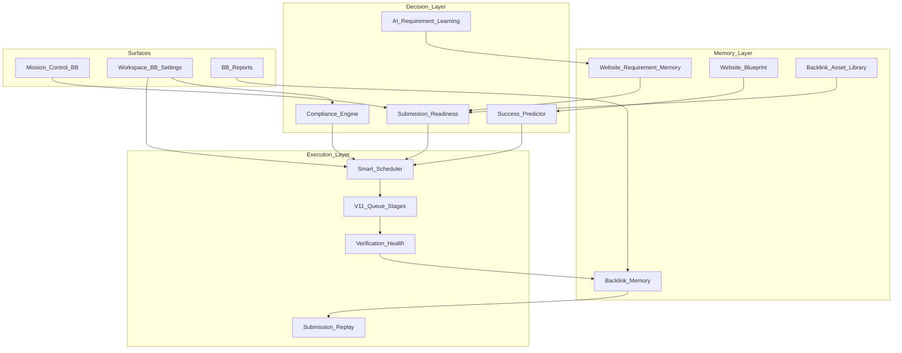

# SEO OS — Backlink Builder Completion Pack (→ 100%)

**Status:** Awaiting approval — **no implementation until approved**  
**Baseline:** SEO OS v1.2 production · Backlink Builder ~97%  
**Mandate:** Close **remaining Backlink Builder gaps only**. Do **not** add new SEO modules. Do **not** rebuild completed functionality.  
**Outcome:** Production-grade AI Backlink Operations / Execution Platform inside Backlink Builder.  
**Suggested tag after ship:** `v1.2.1-bb-complete` or `v1.3.0-bb` (confirm on approval)

---

## Locked decisions

| Topic | Decision |
|-------|----------|
| Scope | **Completion** of Backlink Builder — memory, readiness, pacing, compliance, dashboards, reports, health, assets, settings, UX polish |
| Out of scope | New SEO modules (Technical SEO expansions, marketplace, unrelated agents); full Image Intelligence Engine as a separate product (reuse existing media briefs/assets paths only where BB needs images) |
| Compliance language | **No “ban avoidance”** — Rate limiting, cooldowns, pacing, policy warnings, risk/health scores |
| Auth gates | **Never** bypass CAPTCHA, login, or email verification |
| Metrics | Probabilistic fields always carry `metricsSource` + confidence; **never guarantee** outcomes |
| Architecture | Extend V1.0/V1.1 tables, queue stages, Mission Control, reports, domain analyzer, submission requirements |

---

## 1. Architecture changes

### Goal

Eliminate every remaining gap so Backlink Builder is a complete ops loop:

**remember websites & submissions → score readiness → predict (with confidence) → pace via scheduler → comply → execute with human gates → verify health → report → learn.**

### System shape (extend current BB)



### Epic → existing foundation (do not rebuild)

| Epic | Extend | Add (minimal) |
|------|--------|---------------|
| 1 Website Requirement Memory | `submission_requirements`, browser detect, domain analyses | Durable **`website_requirement_memory`** (canonical per domain) |
| 2 Backlink Memory | `backlinks`, submissions, events, relationships | **`backlink_memory`** snapshot + clone links |
| 3 Submission Replay | submissions, content packs, prefill | Replay/duplicate/clone/improve APIs + UI actions |
| 4 Readiness Score | content packs, media briefs, keywords, requirements | **`submission_readiness`** computed + stored |
| 5 Success Predictor | scoring, estimates, recommendations | Predictor DTO + confidence; no guarantee copy |
| 6 Website Blueprint | `website_profiles` (012), analyses | Blueprint view/model over profiles + memory |
| 7 Smart Scheduler | V1.1 queue; daily ops if present | Calendar + daily/weekly/monthly pacing |
| 8 AI Requirement Learning | outcome signals / stage events | Upsert memory from successes |
| 9 Compliance Engine | robots.txt fetch, dual-write stages | Policy engine + risk/health; rename any bad copy |
| 10 Dashboard | Mission Control + automation summary | BB KPI strip (goal → ETA) |
| 11 Reports | Excel/CSV/PDF ops export | Template set: exec/ops/campaign/verify/image/relationship |
| 12 Backlink Health | `backlink_checks`, reverify | Health score model + timeline fields |
| 13 Asset Library | brand context, content packs, media briefs | **`backlink_asset_library`** reusable NAP/assets/anchors |
| 14 Workspace Settings | `workspace_settings` | BB policy JSON (ask / trusted / auto gates) |
| 15 Production Quality | existing UI patterns | Skeletons, a11y, shortcuts, optimistic UX, audits |

### Principles

1. Domain logic in `@seo-os/backlink-builder`; thin routes.  
2. `queue_stage` remains stage SoT when set; memory/replay never fork a second pipeline.  
3. Learning updates **memory & scores**, never auto-bypasses gates.  
4. Scheduler creates **paced work**, not silent third-party posts.  
5. Predictor always shows **confidence** and “Estimated — not a guarantee”.

### Feature flags

```
bb_requirement_memory
bb_backlink_memory
bb_submission_replay
bb_readiness_score
bb_success_predictor
bb_website_blueprint
bb_smart_scheduler
bb_requirement_learning
bb_compliance_engine
bb_mission_control_v2
bb_reports_v2
bb_backlink_health
bb_asset_library
bb_workspace_policy
bb_production_quality
```

(Master: `bb_completion_pack` optional umbrella.)

---

## 2. Database migrations

**Proposed series:** `044_bb_completion_memory.sql` … `050_bb_completion_polish.sql`  
(Adjust numbers if Image Intelligence / BAE already occupied lower IDs.)

### `044_bb_website_requirement_memory.sql`

`website_requirement_memory` (unique `workspace_id + site_domain` or global+override):

- submission_url, registration_url, login_url  
- requires_login, requires_email_verification, requires_captcha, requires_phone_verification, requires_business_verification  
- required_categories[], required_tags[]  
- required_images, required_videos (bool or JSON counts/rules)  
- required_word_count, maximum_links  
- anchor_rules JSONB  
- accepted_file_types[], accepted_image_sizes JSONB, accepted_video_sizes JSONB  
- avg_review_hours, avg_approval_hours, avg_success_rate, avg_rejection_rate (`metrics_source`)  
- previous_campaign_history JSONB, previous_submission_history JSONB  
- notes, confidence, last_learned_at, source (`detected`|`user`|`learned`|`merged`)  

FK optional from `submission_requirements.memory_id`.  
Migrate/merge existing opportunity-level requirements into memory on detect.

### `045_bb_backlink_memory_replay.sql`

`backlink_memory`:

- workspace_id, backlink_id nullable, submission_id nullable, opportunity_id, campaign_id  
- website_domain, keywords[], anchor_text, landing_page  
- images_used JSONB, videos_used JSONB, content_ref (pack_id / draft ids)  
- submitted_at, approved_at, verified_at, status  
- traffic_est, relationship_id, notes  
- fingerprint for clone  

`submission_replay_log`: parent_memory_id / parent_submission_id, action (`replay`|`duplicate`|`clone`|`improve`), new_submission_id, created_by, created_at

### `046_bb_readiness_predictor_blueprint.sql`

- `submission_readiness` — opportunity_id UNIQUE, scores JSONB (`business`,`content`,`images`,`videos`,`links`,`categories`,`keywords`,`submission`,`overall`), missing[] , updated_at  
- Extend opportunities or side table `success_predictions` — approval_probability, review_hours, publication_hours, seo_value, referral_potential, difficulty, spam_risk, confidence, metrics_source  
- `website_blueprints` — domain PK scope, industry, country, language, cms, authority_est, trust_est, spam_est, relationship_summary, submission_types[], content_preferences JSONB, image_requirements JSONB, video_requirements JSONB, history JSONB, recommendations JSONB, metrics_source  

Reuse `website_profiles` where columns overlap — blueprint is the **BB-facing aggregate**, not a second crawl system.

### `047_bb_scheduler_compliance.sql`

- `bb_schedules` — workspace_id, mode (`automatic`|`manual`), horizon (`daily`|`weekly`|`monthly`|`campaign`), capacity JSONB, timezone  
- `bb_schedule_slots` — schedule_id, slot_at, backlink_type, capacity, filled, status  
- `bb_scheduled_items` — slot_id, opportunity_id / submission_id, status  
- `compliance_policies` / events — rate_limit, cooldown, duplicate, pacing, policy_warning, manual_approval_required, risk_score, health_score  
- `site_domain_cooldowns` — domain, next_allowed_at, reason  

### `048_bb_asset_library_settings.sql`

`backlink_asset_library` items:

- kind: business_name, description, logo, image, video, keyword, category, social_link, address, phone, email, landing_page, anchor  
- label, value / storage_path, metadata JSONB, tags[], is_default  

`workspace_settings.bb_policy` JSONB (or `bb_workspace_policies` table):

- submission_policy: `always_ask` | `trusted_websites` | `automatic_where_appropriate`  
- trusted_domains[]  
- daily_submission_goal, working_hours, submission_speed, retry_policy, verification_frequency  

### `049_bb_backlink_health.sql`

Extend `backlinks` / checks:

- health_score, authority_score, spam_score, trust_score  
- anchor_diversity_score, placement_score, freshness_score  
- verification_status, last_checked_at, lost_at  

`backlink_health_snapshots` optional for history.

### `050_bb_learning_indexes.sql`

- Indexes for memory domain lookup, readiness overall, schedule slots by date, compliance events  
- Trigger or app hook: on submission `accepted`/`verified` → learning upsert into requirement memory  

---

## 3. API contracts

Base: `/v1/projects/:projectId/backlink-builder/...`

### Epic 1 — Requirement Memory

- `GET /requirement-memory?domain=`  
- `PUT /requirement-memory/:domain`  
- `POST /requirement-memory/detect` `{ opportunityId | url }` — merge into memory  
- Auto-read on preview/prefill (internal)

### Epic 2–3 — Backlink Memory & Replay

- `GET /backlink-memory` · `GET /backlink-memory/:id`  
- `POST /backlink-memory/from-submission/:submissionId` — snapshot  
- `POST /backlink-memory/:id/replay` `{ mode: replay|duplicate|clone|improve, opportunityId? }`  
- Improve = clone + readiness gaps flagged

### Epic 4 — Readiness

- `GET /opportunities/:id/readiness`  
- `POST /opportunities/:id/readiness/recompute`  
- Response: per-dimension scores + `missing[]` + `overall`

### Epic 5 — Success Predictor

- `GET /opportunities/:id/prediction`  
- Fields + `confidence` + disclaimer flag `guaranteed: false` always

### Epic 6 — Website Blueprint

- `GET /blueprints/:domain` · `POST /blueprints/:domain/refresh`  
- `GET /blueprints` (list)

### Epic 7 — Smart Scheduler

- `GET /scheduler/calendar?from=&to=`  
- `PUT /scheduler/settings`  
- `POST /scheduler/generate` `{ horizon, campaignId? }`  
- `POST /scheduler/slots/:id/assign`  
- Modes: automatic pacing | manual pacing | queue optimize

### Epic 8 — Learning

- Internal hooks on stage transitions;  
- `POST /learning/recompute-memory` `{ domain? }`  
- `GET /learning/recent`

### Epic 9 — Compliance

- `POST /compliance/check` `{ opportunityId | submissionId }` → `{ allowed, warnings[], blockers[], riskScore, healthScore }`  
- `GET /compliance/events`  
- Blockers include captcha/login/email_verify; **no bypass endpoints**

### Epic 10 — Dashboard

- Extend `GET /mission-control/summary` / automation summary with BB completion KPIs (Today’s Goal, Qualified→Failed, rates, avgs, top types, workforce, queue, ETA)

### Epic 11 — Reports

- `GET /reports/bb/:template.(xlsx|csv|pdf)`  
  templates: `executive`, `operations`, `campaign`, `verification`, `image`, `relationship`  
- Or `POST /reports/generate` `{ template, format }`

### Epic 12 — Health

- `GET /backlinks/:id/health`  
- `POST /backlinks/:id/health/refresh`  
- Timeline reuse checks API

### Epic 13 — Asset Library

- `GET|POST /asset-library` · `PATCH|DELETE /asset-library/:id`  
- `POST /asset-library/:id/apply` `{ opportunityId }`

### Epic 14 — Settings

- `GET|PUT /settings/bb-policy`

### Epic 15 — Quality

- No new domain API; enforce UX + `audit_logs` on policy/replay/scheduler mutations

All predictor/estimate fields: `metricsSource`, `confidence`.

---

## 4. UI wireframes

### Nav (additive labels only)

… · Explorer · **Blueprints** · **Requirement Memory** · **Asset Library** · Submission Queue · **Scheduler** · Submission Center · Verification · **Backlink Memory** · Reports · **BB Settings** · …

### Key screens

1. **Requirement Memory** — domain search · full field grid (URLs, gates, categories, media, word count, rates) · notes · “Used by AI automatically” badge · history  
2. **Website Blueprint** — profile card: industry/country/CMS/Estimated authority-trust-spam · submission types · preferences · recommendations · link to memory  
3. **Readiness panel** (on opportunity + queue drawer) — overall % ring · 8 dimension checklist · missing items CTAs (add content, images, categories…)  
4. **Success Predictor** — cards with confidence bars · footer: “Estimates only — not a guarantee”  
5. **Backlink Memory** — table/filters · Replay / Duplicate / Clone / Improve actions  
6. **Scheduler** — calendar (day/week/month) · capacity · auto vs manual · optimize queue  
7. **Compliance** — inline warnings on submit/schedule · Risk/Health scores · events log · policy copy (no ban-avoidance language)  
8. **Mission Control BB strip** — Today’s Goal · funnel statuses · success/approval rates · avg review/verify · top types · workforce · queue · ETA  
9. **Asset Library** — NAP, logos, anchors, landing pages, socials · set default · apply to opportunity  
10. **BB Settings** — Always Ask / Trusted / Automatic (where appropriate) · daily goal · working hours · speed · retry · verification frequency  
11. **Reports** — template picker · Excel/CSV/PDF  
12. **Backlink Health** — on verification/detail: health + component scores · last checked · lost date  

### Production quality (Epic 15) UX bar

- Skeletons on all BB list/detail loads  
- Optimistic stage moves with rollback toast  
- Focus order + aria on Kanban/calendar  
- Shortcuts: `g q` queue, `g s` scheduler, `r` recompute readiness (document in help)  
- Empty states with Next Best Action  
- Mobile: stack boards; calendar agenda mode  

---

## 5. Worker updates

| Job | Queue | Purpose |
|-----|-------|---------|
| `bb_requirement_detect_merge` | CRAWL | Detect → upsert requirement memory |
| `bb_readiness_recompute` | LOW | Batch readiness after pack/media/keyword changes |
| `bb_prediction_refresh` | LOW | Refresh predictions when memory/blueprint updates |
| `bb_scheduler_tick` | LOW/CRON | Advance slots → ready queue; respect working hours + compliance |
| `bb_learning_from_outcome` | LOW | On accepted/verified/rejected → update memory averages + rules |
| `bb_compliance_sweep` | LOW | Expire cooldowns; emit policy warnings |
| `bb_health_reverify` | CRAWL | Extend existing reverify; write health scores + lost_at |
| `bb_memory_snapshot` | LOW | On terminal statuses → backlink_memory row |

**Hooks (in-process, not new queues):**  
`transitionSubmissionStage` → learning + memory snapshot + compliance event;  
`createContentPack` / media review → readiness invalidate.

**Safety:** Playwright/submit paths unchanged regarding CAPTCHA/login/email verify — compliance **blocks** automation when gates present unless policy is Always Ask → user authorize.

---

## 6. Risk assessment

| Risk | Impact | Mitigation |
|------|--------|------------|
| Dual sources of truth (opp requirements vs memory) | Stale prefills | Memory is canonical; opp row is cache; merge on detect |
| Replay spams same site | Policy / reputation | Compliance duplicate + cooldown; trusted vs always_ask |
| Predictor overconfidence | Enterprise trust | Confidence + disclaimer; never `guaranteed: true` |
| Automatic policy misuse | Unwanted submits | Default `always_ask`; automatic only when no gates + readiness 100% + compliance allow |
| Scheduler vs Daily Ops / V1.1 queue confusion | UX debt | One calendar UX; stages stay on `queue_stage`; copy: Scheduler paces, Queue tracks |
| Learning pollutes memory from one-off luck | Bad rules | Min sample sizes; confidence caps; user override wins |
| PII in asset library | Privacy | Encrypt sensitive fields option; RLS; audit access |
| Scope = 15 epics slip | Incomplete “100%” | Phased A–E below; each flaggable; DoD checklist per epic |
| Ban-avoidance language leftovers | Brand/compliance | Epic 9 copy audit in UI/docs |

---

## 7. Implementation plan

**Do not start until approved.**

| Phase | Epics | Migrations | Exit criteria |
|-------|-------|------------|---------------|
| **A — Memory foundation** | 1, 6, 13 | 044, part 046, 048 assets | Memory + blueprint + asset library CRUD; AI prefill reads memory |
| **B — Readiness & predict** | 4, 5 | 046 | Readiness % + missing; predictor with confidence |
| **C — Replay & learning** | 2, 3, 8 | 045, 050 hooks | Snapshot + replay/clone/improve; learning updates memory |
| **D — Pace & comply** | 7, 9, 14 | 047, 048 settings | Calendar scheduler; compliance check; BB policy settings |
| **E — Health, dash, reports, polish** | 10, 11, 12, 15 | 049 | MC KPIs; report templates; health scores; a11y/skeletons/shortcuts |
| **F — Hardening** | — | indexes | Typecheck/tests; audit logs; smoke; deploy; tag |

**Default policy for new workspaces:** `always_ask`, daily goal 20 (configurable), verification frequency = existing reverify cadence.

**Explicit non-goals:** CAPTCHA solve, login bypass, email-verify bypass, silent mass submit, rebuilding Content Studio / Browser Assistant / OAuth from scratch.

---

## Definition of Done (Backlink Builder 100%)

- [ ] Every known site can persist full requirement memory; AI reuses automatically  
- [ ] Every submission can become backlink memory; replay/duplicate/clone/improve work  
- [ ] Every opportunity shows readiness % + missing + success prediction with confidence (no guarantees)  
- [ ] Every site has a reusable blueprint  
- [ ] Smart scheduler paces daily/weekly/monthly/campaign with calendar  
- [ ] Learning updates requirement memory from outcomes  
- [ ] Compliance: rate limit, cooldown, duplicate, pacing, policy warnings, risk/health — never bypass CAPTCHA/login/email verify  
- [ ] Mission Control shows full BB KPI set + workforce + queue + ETA  
- [ ] Reports: six templates × Excel/CSV/PDF  
- [ ] Backlink health scores + lost tracking  
- [ ] Asset library reusable across submissions  
- [ ] Workspace BB policy configurable  
- [ ] Production UX quality bar met; no placeholder BB flows  
- [ ] No regressions to V1.0/V1.1 completed modules  

---

## Approval checklist

Confirm or amend before any implementation code:

1. Ship as **Backlink Builder Completion** (this pack only) — defer standalone Image Intelligence / broad V1.2 epic train?  
2. Phase order **A→F**?  
3. Default submission policy **`always_ask`**?  
4. Default daily goal **20** vs **100**?  
5. Automatic mode allowed **only** when readiness 100% + no auth/CAPTCHA gates + compliance allow?  
6. Version tag **`v1.2.1`** vs **`v1.3.0`**?  
7. Migration ID start **044+** OK?

**No implementation will start until you approve this pack.**
