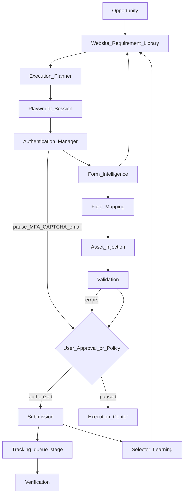

# SEO OS — Browser Execution Engine (BEE)

**Status:** Implemented (v1.2.5-bee-resume — watchers + auto-resume)  
**Baseline:** SEO OS v1.2.5 · Backlink Builder production-complete  
**Module:** Browser Execution Engine (BEE)  
**Nature:** Production browser **execution** framework (not a demo; not Browser Intelligence alone)  
**Mandate:** Extend Backlink Builder + existing Playwright / V1.1 browser assistant. **Do not rebuild** completed BB functionality.

---

## Locked decisions

| Topic | Decision |
|-------|----------|
| Role | Execute **user-authorized** submission workflows via Playwright |
| Relation to Browser Intelligence | Intelligence **detects/scans**; BEE **executes plans** — share requirement library / profiles; separate execution tables |
| Relation to V1.1 assist | `browser_action_plans` / `browser_assist_sessions` become **inputs or legacy views**; BEE owns `execution_*` + `browser_sessions` as SoT for runs |
| Gated actions | On CAPTCHA / MFA / email verify / phone verify / login security / ToS conflict → **pause + user intervention** — never bypass |
| Auto-submit | Only when workspace policy = Automatic Eligible **and** no gates **and** user/org rules allow |
| Credentials | Encrypted only (`ENCRYPTION_KEY` / integration_credentials); never in logs, job payloads, or UI |
| robots.txt / policies | Respect where applicable; policy warnings in compliance |
| Provider/modular | Browser runtime adapter (Playwright default); swappable later (e.g. remote browser) behind interface |

**Non-negotiables (carry forward):** Never bypass CAPTCHA, MFA, email verification, login security, or ToS. Never impersonate users. Require authorization where appropriate.

---

## 1. Architecture

### Goal

Run end-to-end, user-controlled backlink submission workflows:

Opportunity → Requirement Library → Execution Planner → Playwright Session → Auth → Form Detection → Field Mapping → Asset Injection → Validation → User Approval (if required) → Submission → Tracking → Verification → Learning.

### Pipeline



### Layering (extend, do not rebuild)

| Layer | Package / service | Notes |
|-------|-------------------|--------|
| Domain | `@seo-os/backlink-builder` — planner, form schema, mapping, learning DTOs | Pure logic |
| Browser runtime | `BrowserExecutionService` in API or `workers/playwright` | Playwright adapter |
| Auth | Reuse site accounts / integration credentials crypto | Auth Manager facade |
| Assets | Backlink Asset Library + content packs + media briefs | Asset Mapper |
| Tracking | Existing `queue_stage` / submissions / events | Dual-write on submit result |
| Verification | Existing HTTP verify / health | Post-execution enqueue |
| Policies | BB workspace policy + `execution_policies` | Always Ask / Trusted / Automatic Eligible |
| UI | Execution Center (new) + Mission Control widget | |

### Core service: `BrowserExecutionService`

Responsibilities:

- Launch browser (headless/headed)
- Persistent sessions & multiple browser profiles
- Cookies / storage state
- Downloads / uploads
- Screenshots
- Execution logs
- Browser health checks

Interface (modular):

```ts
interface BrowserRuntime {
  launch(profile: BrowserProfile): Promise<BrowserSessionHandle>;
  restore(storageState): Promise<BrowserSessionHandle>;
  health(): Promise<RuntimeHealth>;
}
// Default: PlaywrightBrowserRuntime
```

### Epic map

| Epic | Name | Outcome |
|------|------|---------|
| A | Playwright Engine | `BrowserExecutionService` + sessions |
| B | Execution Planner | Editable step plans |
| C | Form Intelligence | Detect controls → requirement library |
| D | Authentication Manager | OAuth/creds/cookies; pause on MFA/CAPTCHA/email/phone |
| E | Asset Mapper | Project assets → fields; manual override |
| F | Submission Engine | Prepare / preview / manual / auto (policy) / pause-resume / retry / rollback-best-effort |
| G | Workspace Policies | Always Ask, Trusted, Automatic Eligible, caps, hours, speed, retry, cooldown, compliance level |
| H | Execution Dashboard | Live session/step/queue/ETA/errors |
| I | Execution History | Screenshots, logs, console, values, timings, replay |
| J | Learning Engine | Selectors success/fail → `selector_memory` + requirement library |
| K | Mission Control | BEE widget |
| L | Database | Migrations 051–058 |

### Feature flags

```
bee_enabled                 # master
bee_headed_debug            # allow headed in non-prod / opt-in
bee_automatic_submit        # must be on AND policy Automatic Eligible
bee_learning                # selector learning worker
bee_remote_runtime          # future; default false
```

Keep `v11_browser_assist_fill` as legacy gate or fold under `bee_enabled` (prefer: BEE supersedes assist-fill for new runs).

---

## 2. Database

Migrations as specified (additive):

### `051_browser_sessions.sql`

`browser_sessions`:

- id, workspace_id  
- profile_key (multi-profile)  
- mode (`headless` \| `headed`)  
- status (`idle` \| `running` \| `paused` \| `closed` \| `error`)  
- storage_state_enc (encrypted blob ref or credentials table ref)  
- cookies_ref  
- playwright_context_meta JSONB  
- health_status, last_health_at  
- site_account_id nullable  
- created_at, updated_at, closed_at  

### `052_execution_jobs.sql`

`execution_jobs`:

- id, workspace_id, opportunity_id, submission_id nullable  
- plan_id / plan JSONB snapshot  
- status (`queued` \| `running` \| `paused` \| `needs_approval` \| `blocked_captcha` \| `blocked_mfa` \| `blocked_email_verify` \| `blocked_phone_verify` \| `completed` \| `failed` \| `cancelled`)  
- policy_snapshot JSONB  
- session_id nullable  
- current_step_index  
- eta_seconds nullable  
- error_code, error_message  
- started_at, finished_at  
- metrics JSONB (timings)  

### `053_execution_steps.sql`

`execution_steps`:

- id, job_id, step_index  
- action (`open` \| `login` \| `navigate` \| `upload` \| `fill` \| `select` \| `preview` \| `wait_approval` \| `submit` \| `screenshot` \| `custom`)  
- detail JSONB (editable)  
- selector_hint, status (`pending` \| `running` \| `done` \| `skipped` \| `failed` \| `paused`)  
- started_at, finished_at, error  

### `054_execution_logs.sql`

`execution_logs`:

- id, job_id, step_id nullable  
- level (`debug` \| `info` \| `warn` \| `error`)  
- message, data JSONB (redacted — no passwords)  
- console_events JSONB nullable  
- created_at  

### `055_execution_assets.sql`

`execution_assets`:

- id, job_id, step_id nullable  
- kind (`screenshot` \| `download` \| `upload_ref`)  
- storage_path, mime_type  
- created_at  

### `056_execution_policies.sql`

`execution_policies` (per workspace; merge with BB settings):

- submission_policy: `always_ask` \| `trusted_websites` \| `automatic_eligible`  
- trusted_domains[]  
- max_submissions_per_day  
- working_hours JSONB  
- submission_speed (`slow` \| `normal` \| `fast`)  
- retry_count  
- cooldown_seconds  
- compliance_level (`strict` \| `standard`)  
- require_approval_before_submit boolean (default true unless automatic_eligible path)

### `057_execution_history.sql`

`execution_history` (immutable summary for replay index):

- id, job_id, workspace_id, domain  
- result (`submitted` \| `failed` \| `cancelled` \| `blocked`)  
- form_values_redacted JSONB  
- validation_errors JSONB  
- timing JSONB  
- screenshot_asset_ids[]  
- replay_of_job_id nullable  
- created_at  

### `058_selector_memory.sql`

`selector_memory`:

- workspace_id nullable (global + workspace)  
- site_domain, field_key, control_type  
- selector, selector_alt JSONB  
- success_count, fail_count, last_success_at, last_fail_at  
- confidence  
- source (`detected` \| `learned` \| `user`)  

**Also:** upsert hooks into existing Website Requirement Library / `website_requirement_memory` (from BB completion) — form schema, limits, formats.

**Storage:** Supabase bucket `browser-execution/{workspaceId}/{jobId}/screenshots|downloads`

**RLS:** workspace-scoped on all tables. Credentials never stored in `execution_logs.data`.

---

## 3. API contracts

Base: `/v1/projects/:projectId/browser/...`  
Auth + RBAC: member+ to mutate; viewer read.

| Method | Path | Purpose |
|--------|------|---------|
| POST | `/browser/executions` | Create job from `{ opportunityId, mode?: prepare\|preview\|execute }` → planner generates steps |
| POST | `/browser/preview` | Build plan + optional dry-run detect without submit |
| POST | `/browser/start` | `{ jobId }` launch/resume session, begin worker |
| POST | `/browser/pause` | `{ jobId }` |
| POST | `/browser/resume` | `{ jobId }` after user clears gate |
| POST | `/browser/cancel` | `{ jobId }` |
| POST | `/browser/approve-submit` | Explicit user authorization to pass `wait_approval` / Always Ask |
| PATCH | `/browser/jobs/:id/steps` | Edit plan steps before/during (pending steps) |
| POST | `/browser/jobs/:id/override-mapping` | Manual field mapping overrides |
| GET | `/browser/jobs` | Filter by status |
| GET | `/browser/jobs/:id` | Job + steps + current |
| GET | `/browser/history` | History list |
| GET | `/browser/history/:id` | Detail + assets |
| GET | `/browser/sessions` | Active/idle sessions |
| GET | `/browser/sessions/:id/health` | |
| GET | `/browser/logs` | `{ jobId }` paginated |
| GET | `/browser/policies` · `PUT /browser/policies` | Epic G |
| POST | `/browser/replay` | `{ historyId \| jobId }` → new job |
| GET | `/browser/stats` | Dashboard + Mission Control widget |

**Errors:** `BLOCKED_CAPTCHA`, `BLOCKED_MFA`, `BLOCKED_EMAIL_VERIFY`, `BLOCKED_PHONE_VERIFY`, `POLICY_DENIED`, `ROBOTS_DISALLOW`, `VALIDATION_FAILED` — all leave job **paused/blocked**, never auto-solved.

---

## 4. UI wireframes

### Nav (Backlink Builder additive)

… · Browser Assistant (intelligence) · **Execution Center** · Session Manager · Execution Policies · …

### Screens

1. **Execution Center**  
   Queue · Running · Paused · Blocked (CAPTCHA/MFA/Email) · Needs Approval · Completed today · Failed  
   Actions: Start / Pause / Resume / Cancel / Approve Submit  
   Panel: current website, current step, ETA, success rate

2. **Execution Timeline**  
   Vertical steps (editable before start; lock completed) · status chips · click → screenshot

3. **Execution Logs**  
   Stream + filter level · redacted form values · console subset · download log

4. **Browser Preview**  
   Latest screenshot / headed debug link (flag) · not a live VNC MVP unless approved later  
   Gate banner: “CAPTCHA detected — complete in browser, then Resume”

5. **Session Manager**  
   Profiles · health · last used · reconnect / reauth · never show secrets

6. **Execution Policies**  
   Always Ask · Trusted Websites · Automatic Eligible  
   Max/day · working hours · speed · retry · cooldown · compliance level  
   Copy: compliance language only (no bypass framing)

7. **Mission Control widget**  
   Running · Queued · Paused · Completed · Failed · Needs Approval · Blocked CAPTCHA · Blocked MFA · Avg execution time

### UX control loop

| State | User action |
|-------|-------------|
| Needs Approval | Review mapping + Approve Submit |
| Blocked CAPTCHA/MFA/Email/Phone | Complete challenge → Resume |
| Validation failed | Fix override mapping → Resume |
| Policy Denied | Change policy or switch to Manual |

---

## 5. Worker design

| Worker | Queue | Responsibility |
|--------|-------|----------------|
| **Execution Worker** | `PLAYWRIGHT` (primary) | Run job steps via `BrowserExecutionService`; pause on gates; screenshots; update steps/logs |
| **Selector Learning Worker** | `LOW` | On step success/fail → upsert `selector_memory`; merge form intel into requirement library |
| **Replay Worker** | `PLAYWRIGHT` | Clone plan from history; new job; re-map assets |
| **Health Worker** | `LOW` | Session/runtime health; stale session cleanup mark |
| **Cleanup Worker** | `LOW` | Expire old screenshots per retention; close zombie sessions |

### Execution Worker algorithm (simplified)

1. Load job + policy + requirement memory + asset mapping.  
2. Acquire/create `browser_sessions` (restore storage state if auth manager allows).  
3. For each step:  
   - If action is login/auth and MFA/CAPTCHA/email/phone detected → set blocked_* , screenshot, **return** (pause).  
   - If `wait_approval` or policy Always Ask before submit → `needs_approval`, pause.  
   - If Automatic Eligible and gates clear and `bee_automatic_submit` → submit.  
   - On validation messages → pause with `VALIDATION_FAILED`.  
4. On submit success → dual-write submission tracking + enqueue verification.  
5. Emit learning events.  
6. Idempotent job key: `bee-exec-{jobId}`; step retries honor `retry_count` + backoff; **never** retry CAPTCHA solve.

### Concurrency

- Cap parallel sessions per workspace (policy / env `BEE_MAX_SESSIONS`).  
- Submission speed inserts human-like delays (slow/normal/fast).

---

## 6. Security review

| Area | Control |
|------|---------|
| Credentials | Encrypt at rest; resolve inside worker only; strip from logs/history (`form_values_redacted`) |
| Session state | `storage_state_enc` via credentials table; rotate on reauth |
| Authorization | User must Approve Submit under Always Ask; Automatic only when eligible + flag + no gates |
| Impersonation | No credential stuffing across users; session bound to workspace + site_account |
| CAPTCHA/MFA/Email/Phone | Detect → pause; no third-party solving services |
| ToS / robots | Pre-check where applicable; `compliance_level=strict` blocks on disallow |
| XSS/log injection | Sanitize log messages; size-cap console capture |
| Screenshot PII | Bucket private; signed URLs; retention policy |
| RBAC | Members execute; admins edit policies; viewers read |
| Audit | `audit_logs` on start/approve/policy change/cancel |
| Supply chain | Pin Playwright version; sandbox browser args; no `--no-sandbox` in prod without review |
| Network | Optional allowlist egress; block local file exfil |

**Threats explicitly rejected:** CAPTCHA farms, MFA bypass, silent credential replay without user-bound session, cross-tenant session reuse.

---

## 7. Risk assessment

| Risk | Impact | Mitigation |
|------|--------|------------|
| Site DOM churn breaks selectors | High fail rate | selector_memory + alts; learning; manual override; pause not loop |
| Headless detection | Blocks | Headed opt-in; residential caution (no ToS evasion framing); pause for user |
| Automatic Eligible misuse | Unwanted posts | Default Always Ask; automatic requires flag + readiness + no gates |
| Credential leak via screenshots | Privacy | Redact; private storage; short retention |
| Resource exhaustion | Infra cost | Session caps; cleanup worker; queue limits |
| Confusion vs Browser Intelligence | UX debt | Clear IA: Intelligence = understand; Execution Center = run |
| Legal/ToS | Account bans | Policy warnings; never bypass gates; user authorization |
| Rollback incomplete | Partial submits | “Best-effort rollback”; document limits; status Failed + notes |
| Replay duplicates | Spam | Compliance duplicate/cooldown from BB completion pack |

---

## 8. Implementation plan

**Do not implement until this pack is approved.**

| Phase | Epics | Migrations | Exit criteria |
|-------|-------|------------|---------------|
| **A** | A, G (policy read) | 051, 056 | BrowserExecutionService launch/health; policies CRUD |
| **B** | B, C | 052, 053 + library upsert | Planner + form detect → editable steps |
| **C** | D, E | — | Auth manager + asset mapper + pause gates |
| **D** | F, I | 054, 055, 057 | Prepare/preview/manual/auto; logs; screenshots; history |
| **E** | H, K, J | 058 | Dashboard + MC widget + learning worker |
| **F** | Replay, Cleanup, Health workers | — | Replay; retention; harden; flags; tag e.g. `v1.2.2-bee` or `v1.3.0` |

**Defaults:** policy `always_ask`; `bee_automatic_submit` false; headless default; headed behind `bee_headed_debug`.

**Integration-only touches to completed BB:**  
- Read requirement memory / asset library / queue stages  
- Dual-write submission events on success  
- Enqueue existing verification  
- Mission Control summary fields  

**Out of scope:** CAPTCHA solving, MFA bypass, email-verify bypass, user impersonation, remote stealth browser farms, rewriting Browser Intelligence or Submission Queue.

---

## Definition of Done

- End-to-end workflow on supported sites: plan → session → map assets → validate → user-authorized submit → track → verify → learn  
- All gate types pause for intervention  
- Policies enforce Always Ask / Trusted / Automatic Eligible correctly  
- Credentials encrypted; logs redacted  
- Execution Center + history + MC widget live  
- Selector learning updates requirement library  
- No rebuild of completed Backlink Builder modules  
- Non-negotiables enforced in code paths and tests  

---

## Approval checklist

Confirm or amend before any implementation code:

1. BEE SoT = new `execution_*` / `browser_sessions`; V1.1 assist remains compatibility layer?  
2. Default policy **Always Ask**; automatic behind flag + Automatic Eligible only?  
3. MVP Browser Preview = **screenshots** (not live streaming)?  
4. Migration IDs **051–058** as specified?  
5. Version tag after ship: **`v1.2.2`** vs **`v1.3.0`**?  
6. Max concurrent sessions per workspace default (**1** vs **3**)?  

**No implementation will start until you approve this pack.**
