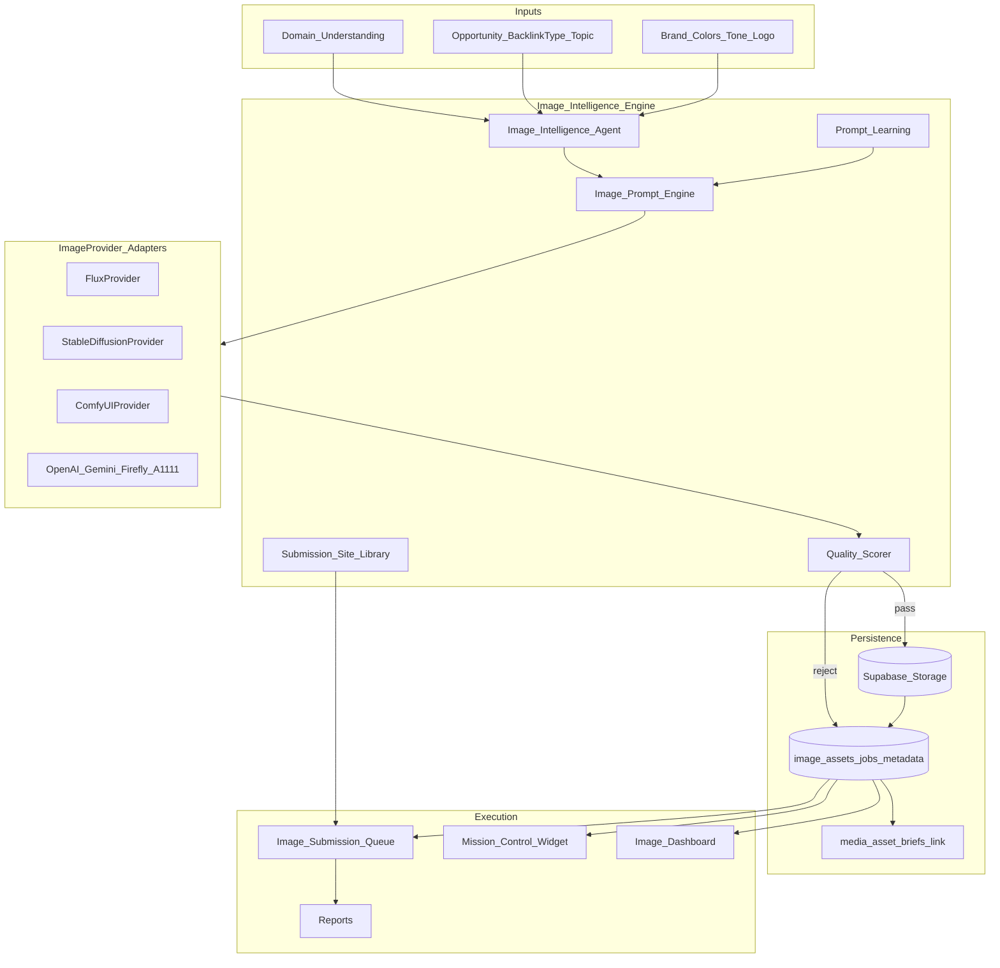
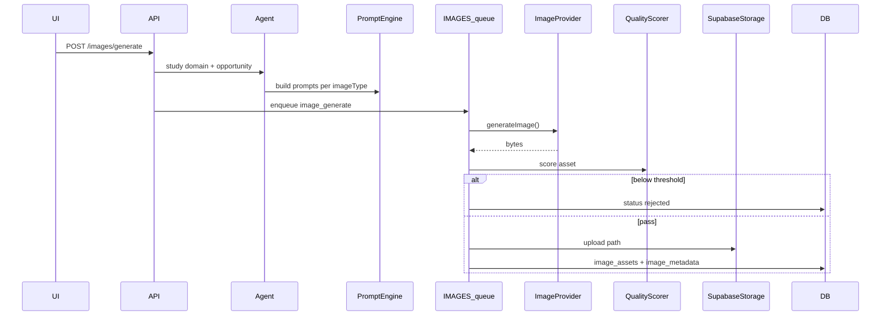

# SEO OS — Image Intelligence Engine (Architecture Pack)

**Status:** Awaiting approval — **no implementation until approved**  
**Baseline:** SEO OS v1.2 production — do **not** rebuild existing modules  
**Module:** Image Intelligence Engine (IIE)  
**Integrates with:** Backlink Builder, Content Studio, Media Studios (V1.1 metadata), Mission Control, Reports, provider registry  

---

## Locked decisions

| Topic | Decision |
|-------|----------|
| Scope | **New enterprise module** that extends (does not replace) `media_asset_briefs` + Image Studio UX |
| Default provider | **FLUX / Stable Diffusion (FREE)** — no paid API required |
| Provider selection | Config / `image_provider_settings` only — **never hardcode** in UI or routes |
| Future providers | OpenAI Images, Gemini Images, Adobe Firefly, ComfyUI, AUTOMATIC1111 — same `ImageProvider` interface |
| Prompts | Auto-generated from domain + opportunity; user edits only when needed |
| Quality | Auto-score; reject below thresholds before “Ready” |
| Storage | Supabase Storage with project/campaign folder tree |
| Flags | `v12_image_generation`, `v12_flux`, `v12_sdxl`, `v12_comfy` |

**Hard rules:** No CAPTCHA/auth bypass in submission paths. Estimated metrics labeled. No demo/placeholder providers that fake binary assets. Fail closed when no free provider runtime is reachable.

---

## 1. Architecture document

### Goal

Automatically study the user’s domain and backlink opportunity, generate SEO-optimized visual assets via a **swappable image provider**, score/store/review them, and prepare image submissions for image-capable websites — as the visual asset system for all backlink campaigns.

### System shape



### Integration (extend, do not rebuild)

| Existing | IIE relationship |
|----------|------------------|
| `media_asset_briefs` (V1.1) | Keep as **brief/metadata + review** row; `image_assets` holds generated binaries + scores; FK `brief_id` |
| Image Studio / Video Studio pages | Extend Image Studio into IIE workspace; Video Studio unchanged |
| `packages/providers` registry | Register `ImageProvider` alongside AI providers |
| Domain analyzer / brand context | Feed Domain Understanding (business type, niche, colors heuristics) |
| Content packs | Share topic/title/keywords for prompt + metadata |
| Submission queue / Daily Ops | Image submission statuses align with Ready→Verified |
| Requirement library (if present) | Media dims/formats feed preparation checklist |
| Agent contracts / ai-runtime | New `image_intelligence_agent` (or map to `content_agent` + dedicated handler) |

### Principles

1. **Provider-agnostic core** — routes and UI call `ImageProvider` only.  
2. **Domain-first prompts** — never require user prompts for default flows.  
3. **Quality gate** — poor images never enter submission Ready.  
4. **Binary + metadata together** — storage object + `image_metadata` row.  
5. **Learning improves prompts**, not auto-submit to third parties.  
6. Feature-flag every runtime (generation, flux, sdxl, comfy).

---

## 2. Database schema

**Migration series (proposed):** `040_image_intelligence_core.sql` … `043_image_learning_reports.sql`  
(If V1.2 BAE already claimed `030`–`039`, IIE starts at **040**.)

### `image_assets`

| Column | Type | Notes |
|--------|------|-------|
| id | UUID PK | |
| workspace_id | UUID FK | |
| project_id / workspace = project | | |
| campaign_id | UUID nullable | |
| opportunity_id | UUID nullable | |
| brief_id | UUID nullable FK → media_asset_briefs | |
| image_type | TEXT | blog_hero, og, pinterest, … (enum-like check) |
| width / height | INT | |
| storage_path | TEXT | Supabase path |
| public_url | TEXT nullable | signed/public |
| provider_key | TEXT | flux, sdxl, comfy, … |
| prompt_id | UUID nullable | |
| status | TEXT | `generating` \| `scored` \| `approved` \| `rejected` \| `queued_submission` \| `submitted` \| `pending` \| `verified` \| `failed` |
| quality_scores | JSONB | quality, brand_match, seo, submission, resolution, compression, readability |
| rejected_reason | TEXT nullable | |
| created_at / updated_at | TIMESTAMPTZ | |

### `image_generation_jobs`

| Column | Notes |
|--------|-------|
| id, workspace_id | |
| job_type | `generate` \| `variation` \| `upscale` \| `remove_background` |
| provider_key | |
| input JSONB | prompt, size, seed, parent_asset_id |
| status | `queued` \| `running` \| `completed` \| `failed` |
| result_asset_id | nullable |
| error | nullable |
| metrics_source | always track provider latency |
| created_at, finished_at | |

### `image_metadata`

| Column | Notes |
|--------|-------|
| id, asset_id UNIQUE | |
| seo_filename, alt_text, caption, description | |
| keywords TEXT[] | |
| image_title | |
| exif_suggestions JSONB | |
| tags, categories | for submission sites |

### `image_submission_requirements`

Library of image submission websites:

| Column | Notes |
|--------|-------|
| id | |
| site_key | pinterest, flickr, imgur, … |
| site_name, site_url | |
| supported_formats TEXT[] | |
| dimensions JSONB | allowed / preferred |
| max_bytes | |
| categories_schema JSONB | |
| tags_rules JSONB | |
| estimated_review_hours | Estimated |
| estimated_approval_rate | Estimated |
| metrics_source | `estimated` \| `user` \| `live` |
| is_active | |

Seed: Pinterest, Flickr, Imgur, Behance, Dribbble, 500px, Medium Images, Business Directories, Local Directories, Industry Portals.

### `image_submission_history`

| Column | Notes |
|--------|-------|
| id, workspace_id, asset_id | |
| site_key / requirement_id | |
| status | Ready → Submitted → Pending → Approved → Rejected → Verified (+ Failed) |
| checklist JSONB | |
| notes | |
| submitted_at, verified_at, lost_at | |
| outcome_signal for learning | |

### `image_provider_settings`

| Column | Notes |
|--------|-------|
| id, workspace_id nullable (org/global default) | |
| provider_key | flux, sdxl, comfy, openai, gemini, firefly, a1111 |
| enabled | |
| is_default | one default per scope |
| config JSONB | base_url, model, steps — **no secrets** in plain if avoidable |
| secrets_ref | → integration_credentials encrypted |
| health_status, last_health_at | |

### `image_prompt_library`

| Column | Notes |
|--------|-------|
| id, workspace_id nullable | |
| image_type, industry, backlink_type | |
| prompt_template / assembled_prompt | |
| negative_prompt | |
| style_tags | |
| performance JSONB | approval_rate, click_proxy, success |
| source | `agent` \| `learned` \| `user` |
| version | |

### Supporting

- `image_domain_profiles` (optional): cached domain understanding for `chefgaa.com`-style auto study  
- Link columns on `media_asset_briefs.brief` JSON for IIE job ids (non-breaking)  
- RLS: workspace-scoped on all tables  

### Image types (check constraint / catalog table)

Blog Hero, Featured Image, Open Graph, Twitter, LinkedIn Banner, Facebook Cover, Pinterest, Instagram Post, Instagram Story, Directory Logo, Business Banner, Infographic, Feature Illustration, Website Banner, Thumbnail, Product Showcase, Team Illustration, Technology Illustration, Comparison Graphic, Workflow Diagram.

### Standard sizes (catalog + user override)

1200×630, 1600×900, 1920×1080, 1080×1080, 1080×1920, 1000×1500, 512×512, 1280×720.

---

## 3. API contracts

Base: `/v1/projects/:projectId/images` (new router; thin).  
All generate responses include `provider`, `metricsSource` where scores are heuristic.

| Method | Path | Purpose |
|--------|------|---------|
| POST | `/images/generate` | `{ opportunityId?, campaignId?, imageType, width?, height?, count? }` → job(s); auto prompt from domain+opp |
| POST | `/images/variation` | `{ assetId, strength? }` |
| POST | `/images/upscale` | `{ assetId, scale? }` |
| POST | `/images/remove-background` | `{ assetId }` |
| GET | `/images` | Filter by status, type, campaign, opportunity |
| GET | `/images/:id` | Asset + metadata + scores |
| PATCH | `/images/:id/review` | approve / reject |
| POST | `/images/:id/prepare-submission` | `{ siteKey }` → checklist pack |
| POST | `/images/submissions` | queue submission row |
| PATCH | `/images/submissions/:id/status` | stage transitions |
| GET | `/images/providers` | list + health + default |
| PUT | `/images/providers/default` | `{ providerKey }` — config only |
| GET | `/images/jobs` | `/images/jobs/:id` |
| GET | `/images/sites` | submission website library |
| GET | `/images/domain-profile` | cached understanding for project domain |
| POST | `/images/domain-profile/refresh` | re-study domain |
| GET | `/images/stats` | dashboard + Mission Control widget |
| GET | `/reports/images.xlsx\|csv\|pdf` | image / campaign / submission reports |

**Flags:** endpoints no-op or 404 when `v12_image_generation` false; provider-specific 503 if flag off or health down.

**Agent:** `POST /v1/projects/:id/ai/agents/runs` with `agentType: image_intelligence_agent` (or dedicated `/images/agent/run`) — studies domain/opportunity, writes prompts + concepts, enqueues generate jobs.

---

## 4. UI wireframes

### Nav (additive)

Backlink Builder · … · **Image Intelligence** (replaces/extends Image Studio entry) · Image Studio (alias) · …

### Screens

1. **Image Intelligence Home / Dashboard**  
   Today’s Images: Generated · Approved · Submitted · Verified · Failed · Pending  
   CTA: Generate for opportunity / campaign

2. **Generate flow**  
   Select opportunity (or campaign + topic) · auto domain profile summary (business, audience, colors, tone) · image types multi-select · sizes · provider badge (default FLUX/SD) · Generate (no prompt field by default; “Edit prompts” advanced)

3. **Asset gallery**  
   Grid with scores (Quality, Brand, SEO, Submission) · Approve / Reject · Variation / Upscale / Remove BG  
   Rejected show reason

4. **Metadata editor**  
   Filename, alt, caption, description, keywords, title, EXIF suggestions

5. **Submission prep**  
   Site picker (Pinterest, Flickr, …) · requirements (format, dims, max size) · checklist · Queue status pipeline

6. **Provider settings**  
   List providers · health · set default · Comfy/A1111 base URL · never show hardcoded single vendor in copy as the only option

7. **Mission Control widget**  
   Images Generated · Approved · Queued · Submitted · Verified · Rejected · Best Performing

8. **Reports**  
   Export Image / Campaign / Submission · Excel · CSV · PDF

### UX mantra

| Question | IIE answer |
|----------|------------|
| What happened? | Yesterday’s generate/submit counts |
| What is happening? | Jobs running · provider health |
| What should I do next? | Review queued · approve high scores |
| What will AI do next? | Next auto types for open opportunities |

---

## 5. Provider architecture

### Interface (`packages/providers` or `packages/image-intelligence`)

```ts
interface ImageProvider {
  readonly key: string;           // 'flux' | 'sdxl' | 'comfy' | 'openai' | 'gemini' | 'firefly' | 'a1111'
  readonly displayName: string;
  readonly isFreeDefault?: boolean;

  generateImage(input: GenerateImageInput): Promise<GenerateImageResult>;
  generateVariation(input: VariationInput): Promise<GenerateImageResult>;
  upscale(input: UpscaleInput): Promise<GenerateImageResult>;
  removeBackground(input: RemoveBgInput): Promise<GenerateImageResult>;
  health(): Promise<ProviderHealth>;
  // catalog helper — static registry also exposes providers()
}

// Registry
interface ImageProviderRegistry {
  providers(): ImageProviderDescriptor[];
  get(key: string): ImageProvider;
  getDefault(workspaceId: string): Promise<ImageProvider>;
}
```

### Implementations

| Class | Flag | Notes |
|-------|------|-------|
| `FluxProvider` | `v12_flux` | Default FREE path (local/gateway or hosted free tier config) |
| `StableDiffusionProvider` | `v12_sdxl` | SDXL-compatible HTTP API |
| `ComfyUIProvider` | `v12_comfy` | Workflow JSON + base_url |
| `OpenAIProvider` | future | Stub health `unconfigured` until keys |
| `GeminiProvider` | future | Same |
| `FireflyProvider` / `Automatic1111Provider` | future | Same interface |

**Selection:** `image_provider_settings.is_default` → env fallback `IMAGE_PROVIDER_DEFAULT=flux` → first healthy free provider.  
**Never** `if (process.env.USE_OPENAI)` inside routes — only registry resolution.

### Input/output DTO (stable for UI)

```ts
GenerateImageInput: {
  prompt, negativePrompt?, width, height, seed?, imageType, workspaceId
}
GenerateImageResult: {
  bytes | storageUploadHint, mimeType, width, height, providerMeta
}
```

UI never imports `FluxProvider` directly.

---

## 6. Worker architecture

### Queues

| Queue | Jobs |
|-------|------|
| `LOW` or dedicated `IMAGES` (prefer new `QUEUES.IMAGES` if available; else `LOW`) | `image_generate`, `image_variation`, `image_upscale`, `image_remove_bg`, `image_score`, `image_domain_study` |
| `AGENTS` | `image_intelligence_agent` run |
| `CRAWL` | competitor visual heuristics (optional) |
| `CRITICAL` | provider_down alerts (optional) |

### Generate pipeline



### Safety

- Idempotent job keys: `img-gen-{workspace}-{opportunity}-{type}-{size}-{hash}`  
- Timeouts + retry (provider flake); no infinite retry  
- Redact prompts in logs if they contain PII  
- Rate limit per workspace  

### Image Intelligence Agent responsibilities (ordered)

1. Study domain → business type, industry, audience, colors, tone, logo URL, products/services, keywords, competitors  
2. Study opportunity → topic, backlink type, site requirements  
3. Generate visual concepts + prompts (+ negative prompts)  
4. Generate metadata templates  
5. Enqueue generate jobs  
6. After score → store / reject  
7. Queue approved assets for submission prep when backlink type supports images  

---

## 7. Storage architecture

### Supabase Storage bucket

Suggested bucket: `image-intelligence` (private; signed URLs for UI).

### Folder structure

```
projects/{workspaceId}/
  campaigns/{campaignId}/
    blog/
      images/
        generated/{assetId}.{ext}
        approved/{assetId}.{ext}
        rejected/{assetId}.{ext}
        submission/{siteKey}/{assetId}.{ext}
  opportunities/{opportunityId}/
    ...
  domain/{domainHash}/
    logo/
    references/
```

Lifecycle: upload to `generated/` → on approve copy/move to `approved/` → on prepare-submission copy to `submission/{siteKey}/` → reject moves to `rejected/`.

### Object metadata

Storage object metadata mirrors: workspace_id, asset_id, image_type, provider_key (for ops).

### Retention

Configurable; rejected assets retained for learning window then soft-delete.

---

## 8. Risk assessment

| Risk | Impact | Mitigation |
|------|--------|------------|
| Free FLUX/SD runtime unavailable | Generation fails | Health checks; clear empty state; queue retries; allow Comfy/SDXL self-host URL |
| Provider lock-in | Costly rewrite | Strict `ImageProvider` + settings table; UI uses registry only |
| Poor auto prompts | Low approval | Prompt library + learning from outcomes; advanced edit escape hatch |
| Brand mismatch / logo misuse | Brand damage | Brand match score; optional logo overlay step later; human approve before submit |
| Storage cost growth | Bill shock | Quotas per workspace; compress; retention on rejected |
| NSFW / unsafe generations | Trust / ToS | Negative prompts + provider safety; reject on scorer |
| Submission ToS violations | Account bans | Checklist + requirements library; no auto-post without user auth path |
| Confusion with V1.1 metadata-only studio | UX debt | IIE is generation; briefs remain metadata bridge; single Image Intelligence nav |
| Paid providers accidentally default | Surprise cost | Default free only; paid providers `enabled` false until configured |
| EXIF / privacy | Data leak | EXIF suggestions only; strip sensitive EXIF on upload option |

---

## Feature flags

| Flag | Default | Purpose |
|------|---------|---------|
| `v12_image_generation` | false until ship ready | Master IIE |
| `v12_flux` | true when master on | Flux adapter |
| `v12_sdxl` | true | Stable Diffusion adapter |
| `v12_comfy` | false | ComfyUI adapter |

OpenAI/Gemini/Firefly/A1111: add flags when implemented (`v12_openai_images`, etc.).

---

## Implementation plan (post-approval only)

| Phase | Deliverable |
|-------|-------------|
| A | Schema 040+ · provider interface · Flux + SDXL stubs/adapters · flags |
| B | Domain profile + Prompt engine + Agent · generate job worker · storage paths |
| C | Quality scorer · review UI · metadata |
| D | Submission site library · prepare/queue statuses |
| E | Mission Control widget · dashboard · learning hooks |
| F | Reports Excel/CSV/PDF · Comfy provider · harden · tag patch e.g. `v1.2.1` or `v1.3.0` |

---

## Definition of Done (later acceptance)

- Provider interface + Flux/SD default free; Comfy available; futures stubbed  
- Agent auto-studies domain and generates prompts/metadata without user prompt by default  
- All listed image types/sizes supported (catalog + custom)  
- Quality scoring rejects poor assets  
- Supabase folder structure enforced  
- Submission library + checklist + status pipeline  
- Mission Control + dashboard + reports  
- No rebuild of unrelated modules; `media_asset_briefs` preserved as bridge  
- Switching provider requires **config only**, not app rewrite  

---

## Approval checklist

Confirm or amend before any implementation code:

1. Module ships as **Image Intelligence Engine** under Backlink Builder nav (extend Image Studio)?  
2. Migration start number **040+** (after any V1.2 BAE `030`–`039`)?  
3. Default provider **Flux** with **SDXL** as equal free fallback when Flux unhealthy?  
4. Master flag `v12_image_generation` default **false** in prod until Phase F, or **true** with Flux only?  
5. Auto-submit to Pinterest/etc. **out of scope** (prepare + queue + user-authorized submit only)?  
6. Version bump: **`v1.3.0`** (new module) vs patch **`v1.2.1`**?

**No implementation will start until you approve this pack.**
