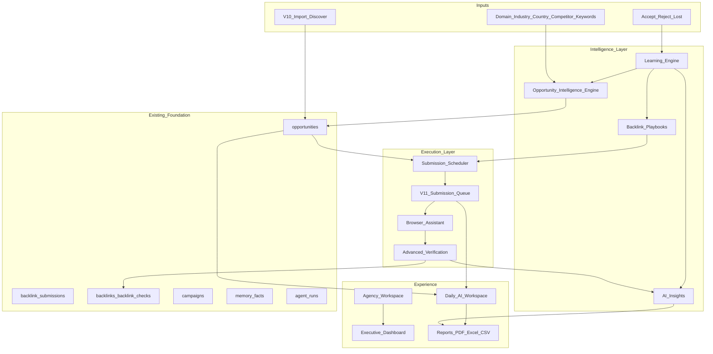

# SEO OS V1.2 — AI Backlink Execution Platform

**Status:** Architecture pack — awaiting approval (no implementation until approved)  
**Baseline:** SEO OS v1.1.0 (production) — V1.0 + V1.1 modules stay intact  
**Codename:** Execution OS  
**Principle:** Agents prepare → users authorize → workers execute/verify → platform learns

---

## Locked product stance

| Decision | Choice |
|----------|--------|
| Scope | Additive V1.2 epic train over V1.1 — do **not** rebuild existing modules |
| Discovery | Continuous + seed-driven Opportunity Intelligence (not replace Import) |
| Submissions | Scheduled / capacity-aware — never bulk-blast |
| Compliance | CAPTCHA / login / email-verify **never** bypassed; assisted paths stay flagged |
| Metrics | Every probabilistic score carries `metricsSource: estimated \| live \| user` |
| Media render | Still out of scope (V1.1 2A metadata only) unless separate approval |
| Version tag (after ship) | `v1.2.0` |

**Hard rules (carry forward):** No demo/placeholder APIs. No removal of V1.0/V1.1 surfaces. Feature flags for every new epic surface.

---

## 1. Architecture document

### Goal

Turn SEO OS from an assisted ops console into an **AI-powered Backlink Execution Platform**: continuous opportunity intelligence, reusable playbooks, outcome learning, paced submission, a daily AI workspace, advanced verification, agency multi-client ops, executive ROI, narrative insights, and production hardening.

### System shape (extend, do not rewrite)



### Epic → existing foundation (reuse map)

| Epic | Extend (do not rewrite) | New surface |
|------|-------------------------|-------------|
| 1 Opportunity Intelligence | `packages/backlink-builder/discovery.ts`, `domain-analyzer.ts`, `classification.ts`, `scoring.ts`, `seo-intelligence/*`, `backlink_discovery_runs`, automation discover | Continuous discovery jobs + seed profiles + typed opportunity catalog |
| 2 Playbooks | `campaign_templates` (008), `workflows`, campaign planner | First-class `backlink_playbooks` + apply-to-campaign |
| 3 Learning Engine | `backlink_submission_events`, accept/reject/lost statuses, `memory_facts`, `ai_events` | Outcome signals → score calibration tables |
| 4 Submission Scheduler | V1.1 queue stages, estimates, pg-boss | Capacity calendar + scheduled slots |
| 5 Daily AI Workspace | Mission Control, queues, notifications, approvals | `/daily` command surface |
| 6 Advanced Verification | `inspectBacklinkHtml`, `backlink_checks`, reverify sweep | Indexability + timeline + lost alerts |
| 7 Agency Workspace | orgs, workspaces, `report_brands`, white_label, org members/roles | Client portfolio + branding UX |
| 8 Executive Dashboard | `/org/executive`, analytics snapshots | ROI / productivity KPI model |
| 9 AI Insights | `analytics_insights`, reports engine | Daily/weekly/monthly narrative jobs |
| 10 Hardening | Epic 11 indexes, ops health, flags | Cron, CRITICAL queue, caching, a11y, bundles |

### Module principles

1. Domain logic in packages; thin routes.
2. Dual-write where V1.1 statuses exist (`queue_stage` remains SoT when set).
3. Learning never auto-submits; it only adjusts **scores and recommendations**.
4. Scheduler creates **planned work**, not silent third-party posts.
5. Agency mode is tenancy UX + rollups — same RLS model, richer IA.

### Feature flags (new)

```
v12_opportunity_intel
v12_playbooks
v12_learning_engine
v12_submission_scheduler
v12_daily_workspace
v12_advanced_verification
v12_agency_workspace
v12_executive_dashboard
v12_ai_insights
v12_hardening
```

---

## 2. Database changes

**Migration series `030`–`039` (proposed)**

### `030_v12_opportunity_intel.sql`

- `opportunity_seeds` — workspace_id, domain, industry, country, competitor_domain, target_keywords[], status, schedule_cron, last_run_at, next_run_at
- `opportunity_discovery_jobs` — seed_id, status, started_at, finished_at, stats JSONB, error
- Extend `opportunities` metadata / columns:
  - `relevance_score`, `estimated_authority`, `estimated_trust`, `spam_risk`, `success_probability` (many already exist — align + backfill)
  - `estimated_review_hours` (align with submission estimates)
  - `recommended_backlink_type`
  - `discovery_channel` (`seed_continuous` \| `import` \| `manual` \| `competitor`)
  - `intel_metrics_source` (`estimated` \| `live`)
- `opportunity_type_catalog` seed rows for: guest_post, directory, citation, forum, qa_site, resource_page, broken_link, podcast, press_release / digital_pr, image_sharing, video_sharing, community

### `031_v12_playbooks.sql`

- `backlink_playbooks` — org_id nullable, workspace_id nullable (org library vs project), slug, name, industry_tags[], target_backlink_types[], anchor_ratio JSONB, submission_frequency JSONB, content_strategy JSONB, expected_timeline JSONB, expected_results JSONB, is_system boolean, version
- `playbook_applications` — playbook_id, workspace_id, campaign_id, applied_at, overrides JSONB
- Seed system playbooks: local_seo, restaurant, saas, healthcare, law_firm, ecommerce, enterprise

### `032_v12_learning_engine.sql`

- `outcome_signals` — workspace_id, opportunity_id, backlink_id nullable, signal (`accepted` \| `rejected` \| `lost` \| `verified`), backlink_type, niche, country, features JSONB, created_at
- `scoring_calibration` — workspace_id nullable (global + per-workspace), dimension, backlink_type, niche_key, weight_delta, sample_size, confidence, updated_at
- `learning_runs` — scope, status, adjustments_count, summary JSONB

### `033_v12_submission_scheduler.sql`

- `submission_schedules` — workspace_id, campaign_id nullable, playbook_id nullable, timezone, weekly_capacity JSONB, status
- `submission_slots` — schedule_id, planned_date, backlink_type, capacity, filled, status (`planned` \| `ready` \| `done` \| `skipped`)
- `scheduled_submissions` — slot_id, submission_id, opportunity_id, planned_at, status
- Link optional `backlink_submissions.scheduled_slot_id`

### `034_v12_daily_workspace.sql`

- Optional materialized view or table `daily_workspace_snapshots` — workspace_id, day, payload JSONB (tasks, opportunities, KPIs)
- Reuse `notifications`, `approvals`, outreach `tasks` — no duplicate task system unless gap found

### `035_v12_advanced_verification.sql`

- Extend `backlink_checks`: `indexability` (`unknown` \| `indexable` \| `noindex` \| `blocked`), `rel_nofollow` boolean, `anchor_match` boolean, `target_match` boolean, `lost_detected_at`
- `backlink_verification_timeline` — backlink_id, event_type, payload JSONB, created_at
- Ensure `backlinks.lost_at` / last_checked fields aligned

### `036_v12_agency_workspace.sql`

- `agency_clients` — org_id, name, primary_workspace_id, brand_profile_id, status, external_ref
- `agency_client_members` — client_id, profile_id, role
- Extend `report_brands` / white-label settings for client-scoped branding
- Reuse `org_members` roles; add client-scoped approval policy JSON on client

### `037_v12_executive_metrics.sql`

- `executive_metric_snapshots` — org_id, workspace_id nullable, period, metrics JSONB (opportunities, qualified, submissions, acceptance_rate, verification_rate, estimated_traffic, estimated_value, relationship_health, ai_productivity, time_saved, roi_index), metrics_source
- Optional link from analytics_snapshots

### `038_v12_ai_insights.sql`

- Extend `analytics_insights` with `period` (`daily` \| `weekly` \| `monthly`), `category` (`summary` \| `recommendation` \| `risk` \| `missed` \| `anchor` \| `competitor`)
- `insight_runs` — workspace_id, period, status, generated_at

### `039_v12_hardening.sql`

- Indexes for new hot paths (seeds, slots by date, outcome_signals, timeline)
- `ops_job_heartbeats` if missing for cron workers
- Feature flag rows for v12_* in beta flags table if used

**Non-goals in schema:** Dropping V1.1 columns; duplicate queue tables when pg-boss + `agent_runs` suffice.

---

## 3. API contracts

Base: `/v1/projects/:projectId/...` unless noted. All probabilistic fields include `metricsSource`.

### Epic 1 — Opportunity Intelligence

- `POST /intelligence/seeds` — create seed `{ domain, industry, country, competitor?, keywords[] }`
- `GET /intelligence/seeds`
- `PATCH /intelligence/seeds/:id`
- `POST /intelligence/seeds/:id/run` — enqueue discovery job
- `GET /intelligence/discovery-jobs`
- `GET /backlink-builder/opportunities?source=intel&type=` — filtered intel feed
- Worker: `opportunity_intel_discover` on `QUEUES.CRAWL` / `INGEST`

### Epic 2 — Playbooks

- `GET /backlink-builder/playbooks` — system + org
- `POST /backlink-builder/playbooks` — custom (member+)
- `POST /backlink-builder/playbooks/:id/apply` `{ campaignId?, overrides? }`
- `GET /backlink-builder/playbooks/:id`

### Epic 3 — Learning Engine

- `POST /backlink-builder/learning/signals` — internal from stage transitions (accepted/rejected/lost)
- `POST /backlink-builder/learning/recalibrate` — enqueue learning run
- `GET /backlink-builder/learning/calibration`
- Hook: `transitionSubmissionStage` / verify lost → emit `outcome_signals`

### Epic 4 — Submission Scheduler

- `GET /backlink-builder/scheduler/calendar?from=&to=`
- `PUT /backlink-builder/scheduler/capacity` — weekly caps by type
- `POST /backlink-builder/scheduler/generate` — build slots from playbook + queue
- `POST /backlink-builder/scheduler/slots/:id/assign` `{ submissionId | opportunityId }`
- Cron: advance slots → move submissions to `ready` / notify Daily Workspace

### Epic 5 — Daily AI Workspace

- `GET /daily/workspace` →  
  `{ greeting, todaysTasks, todaysOpportunities, pendingReviews, pendingApprovals, submittedYesterday, accepted, verified, highPriority, recommendations, nextBestAction }`

### Epic 6 — Advanced Verification

- Keep existing check endpoints
- `GET /backlink-builder/backlinks/:id/timeline`
- `POST /backlink-builder/backlinks/:id/verify` — extended payload (indexability, rel, matches)
- Cron: `backlink_reverify_sweep` → notify `backlink_lost`

### Epic 7 — Agency Workspace

- Org-scoped: `GET|POST /v1/orgs/:orgId/agency/clients`
- `GET /v1/orgs/:orgId/agency/clients/:id/summary`
- `PUT .../branding`
- `GET .../members` + role assignment
- Client report: `POST /reports/generate` with `audience=client` + brand

### Epic 8 — Executive Dashboard

- Extend `GET /v1/executive/summary` + `GET /v1/orgs/:orgId/executive/v12`
- Metrics listed in Success Criteria; label estimated traffic/value

### Epic 9 — AI Insights

- `GET /analytics/insights?period=daily|weekly|monthly`
- `POST /analytics/insights/generate` `{ period }`
- Categories: summary, campaign_recommendations, risk_alerts, missed_opportunities, anchor_diversity, competitor_changes

### Epic 10 — Hardening / Reports

- Reports: extend `GET /reports/backlink-ops.xlsx|csv|pdf` + executive/client/campaign templates
- Health: `GET /health` + ops heartbeats; CRITICAL queue for lost-link alerts
- Flags: `GET /feature-flags` includes v12_*

### AI Workforce mapping (extend V1.1 agents)

| Agent | V1.2 job |
|-------|----------|
| discovery_agent | Continuous seed discovery |
| website_analyzer_agent | Live requirement/trust heuristics |
| keyword_agent | Seed keyword expansion |
| campaign_agent | Playbook apply + schedule generate |
| verification_agent | Advanced verify + timeline |
| reporting_agent | Executive + client + insight narratives |
| relationship_agent | Relationship health for exec dash |

---

## 4. UI designs (IA + wireframes)

### Nav additions (additive; keep V1.1 Backlink Builder IA)

**Backlink Builder:** … · **Opportunity Intel** · **Playbooks** · **Scheduler** · …  
**Workspace:** **Daily** (default home option) · Mission Control · **Agency** (org) · Executive · Unified Inbox · Integrations · Settings

### Key screens

1. **Opportunity Intel** — seed form (domain, industry, country, competitor, keywords) · continuous toggle · results table with Estimated badges (relevance, authority, trust, spam, success, review time, recommended type) · “Add to queue / playbook”
2. **Playbooks** — card grid of system templates · detail: types, anchor ratio, frequency, content strategy, timeline, expected results · Apply → campaign/scheduler
3. **Learning** (settings or Mission Control strip) — calibration confidence, recent outcome signals, last recalibrate
4. **Scheduler calendar** — week view; colored chips by type (directories Mon, guest posts Tue, …); capacity meters; drag assign from queue drawer
5. **Daily AI Workspace** — Good Morning hero · Today’s Tasks · Opportunities · Pending Reviews/Approvals · Yesterday submitted · Accepted/Verified · High Priority · AI Recommendations · Next Best Action CTA
6. **Verification Advanced** — link detail: exists, anchor, target, follow/nofollow, indexability, HTTP, last checked, lost date · timeline · notify banner on loss
7. **Agency** — client list · switch client workspace · brand profile · team roles · approvals · generate client report
8. **Executive Dashboard** — KPI strip (opportunities → value) · acceptance/verification rates · relationship health · AI productivity / time saved · ROI (Estimated)
9. **Insights** — Daily / Weekly / Monthly tabs · risk alerts · missed opportunities · anchor diversity · competitor changes
10. **Reports** — Executive / Client / Campaign · PDF · Excel · CSV

### UX mantra (every page)

| Question | UI element |
|----------|------------|
| What happened? | Activity / yesterday KPIs / timeline |
| What is happening? | Live queues, running discovery jobs, today’s slots |
| What should I do next? | Next Best Action + pending approvals |
| What will AI do next? | Scheduled slots + queued agent jobs |

---

## 5. Implementation plan (phased)

Do **not** start until this pack is approved. Suggested ship order — each phase flaggable and releasable:

| Phase | Epics | Migrations | Outcome |
|-------|-------|------------|---------|
| A | 1 Opportunity Intelligence | 030 | Seed → continuous discover → scored opportunities in DB |
| B | 2 Playbooks + 4 Scheduler | 031, 033 | Templates + calendar capacity |
| C | 3 Learning Engine | 032 | Outcome → calibration → scoring hooks |
| D | 5 Daily Workspace + 9 Insights (MVP) | 034, 038 | Login home + daily/weekly summaries |
| E | 6 Advanced Verification | 035 | Timeline, indexability, loss notifications |
| F | 7 Agency + 8 Executive | 036, 037 | Clients, branding, CEO KPIs |
| G | 10 Hardening + full reports | 039 | Cron, retries, cache, a11y, bundles, tag `v1.2.0` |

**Default duration estimate (planning only):** 7 phases; parallelize B∥C and E∥F after A lands.

**Integration-only touches to V1.1 (allowed):**  
- Emit learning signals from stage/verify paths  
- Scheduler assigns into existing `queue_stage`  
- Daily Workspace aggregates existing APIs  
- Mission Control / Executive summary fields extended  

**Explicit non-goals for V1.2:** CAPTCHA bypass, unattended form post, live image/video pixel render, Google Sheets live import (unless OAuth Sheets scope added in a patch).

---

## 6. Risk analysis

| Risk | Impact | Mitigation |
|------|--------|------------|
| Continuous discovery quality / spam | Bad opportunities flood queue | Relevance threshold + spam_risk gate + human “qualify” before schedule |
| Estimated metrics mistaken for live | Trust / compliance | Enforce `metricsSource` + UI Estimated badges |
| Learning overfitting on small samples | Wrong recommendations | Min sample_size; global prior + per-workspace deltas; confidence caps |
| Scheduler vs user urgency | Missed deadlines | Override slot + “priority break-glass” with audit log |
| Agency data bleed | Security | Keep RLS; client switch only changes workspace context; audit access |
| Executive ROI overclaim | Enterprise credibility | Label traffic/value Estimated; no fake revenue without user inputs |
| Cron/worker cost spikes | Infra bill / rate limits | Job budgets per workspace; backoff; CRITICAL only for lost-link |
| Scope across 10 epics | Slip | Phased flags; A→G shippable alone; no rewrite of V1.1 |
| Playbook vs campaign_templates confusion | UX debt | Playbooks = backlink ops templates; campaign_templates remain campaign-engine; clear copy + apply bridge |

---

## Definition of Done (V1.2) — for later acceptance

- Seed-based continuous discovery stores scored opportunities for all catalog types  
- System playbooks apply into campaigns + scheduler  
- Accept/reject/lost updates calibration and visible scoring confidence  
- Calendar scheduler paces submissions by type/day  
- Daily Workspace answers the four UX questions on login  
- Verification timeline + loss notifications live  
- Agency clients + white-label client reports  
- Executive KPIs with Estimated labels where needed  
- Daily/weekly/monthly AI insights  
- Hardening: cron heartbeats, retries, flags, a11y pass, bundle budgets  
- No V1.0/V1.1 regressions; Railway + Netlify deploy; tag `v1.2.0`

---

## Approval checklist

Please confirm or adjust:

1. Version name **V1.2** (vs V2.0)  
2. Phase order A→G  
3. Continuous discovery allowed to use **estimated** SERP/directory heuristics until live providers configured  
4. Agency model = **org-level clients → workspaces** (not a new tenancy root)  
5. Learning engine adjusts **scores only** (never auto-submit)  
6. Any epic to defer or pull into MVP  

**No implementation will start until you approve this pack (with any amendments).**
