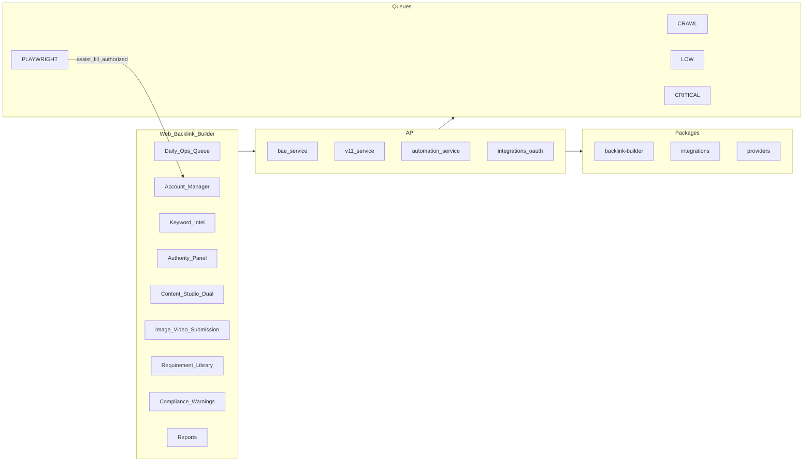
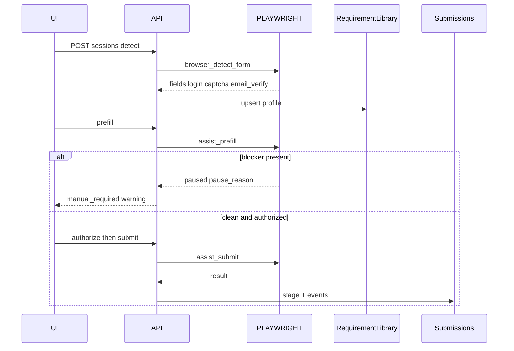

# SEO OS V1.2 — Backlink Automation & Execution Platform

**Status:** Architecture pack — awaiting approval (no implementation until approved)  
**Baseline:** SEO OS v1.1.0 production — Backlink Builder + V1.1 modules stay intact  
**Codename:** BAE (Backlink Automation & Execution)  
**Mandate:** Extend existing Backlink Builder. Do **not** rebuild modules. Integrate the ten capabilities below.

---

## Locked decisions

| Topic | Decision |
|-------|----------|
| Scope | Additive integration into Backlink Builder / V1.1 surfaces |
| Browser submit | Hybrid: detect + prefill + tracked assist; **submit only after user authorization** when login/CAPTCHA/email-verify/manual gate present |
| CAPTCHA / auth | **Never bypass** — Compliance Engine warns and pauses |
| Keywords / authority | Heuristic **Estimated** until live providers plugged in; UI unchanged when provider swaps |
| Image generation | Pluggable provider; metadata always; pixel generate behind provider + review queue |
| Content Studio | Dual mode: **AI Generated** + **Template Generated** (rule-based, no AI) |
| Daily queue | User-set daily target; qualified-only; throttle/cooldown enforced |
| Version after ship | `v1.2.0` |

**Hard rules:** No demo/placeholder APIs. No removal of V1.0/V1.1. Feature flags for new BAE surfaces. Every probabilistic metric: `metricsSource: 'estimated' | 'live' | 'user'`.

---

## 1. Architecture changes

### Goal

Upgrade Backlink Builder from assisted ops into a **production-grade automation & execution loop**:

detect requirements → prepare content/assets/accounts → authorize → paced submit → track → verify → learn website requirements → report.

### System shape (reuse V1.1)



### Capability → existing foundation (do not rewrite)

| # | Capability | Extend | New (minimal) |
|---|------------|--------|---------------|
| 1 | Browser Submission Engine | `browser_action_plans`, `browser_assist_sessions`, `submission_requirements`, `v11_browser_assist_fill`, Playwright handler, `buildPrefillPayload` | Validation-error detection; authorize-then-submit step; submission event trail enrichment |
| 2 | Account Manager | `integration_connections`, `integration_credentials` + `encryptSecret`, Gmail/Outlook OAuth pattern | `site_accounts` for third-party site logins (encrypted); project association; health |
| 3 | Keyword Intelligence | `keyword-engine.ts`, `keywords.is_primary`, V1.1 discover API | `KeywordProvider` interface (heuristic default → commercial later) |
| 4 | Authority Engine | `domain-analyzer` Estimated DR/traffic note | `AuthorityProvider` interface + confidence field |
| 5 | Content Studio dual mode | Content packs / generators | `template` assembly path (sections + business info, no AI) |
| 6 | Image & Video Submission | `media_asset_briefs` (2A metadata) | Optional `MediaGenerateProvider`; review queue; requirement-aware pack |
| 7 | Website Requirement Library | `submission_requirements` per opportunity | Durable `website_requirement_profiles` keyed by domain (+ outcomes) |
| 8 | Daily Operations Queue | V1.1 Kanban `queue_stage` | Daily target, qualification filter, throttle counters, ops board statuses |
| 9 | Compliance Engine | robots.txt in domain-analyzer; stage dual-write | Rate limit, duplicate, variation, cooldown, retry, manual-action warnings |
| 10 | Reporting | `reports` + backlink-ops xlsx/csv/pdf | Columns for BAE statuses + estimate fields + notes |

### Principles

1. Domain logic in `@seo-os/backlink-builder` + `@seo-os/integrations` / `@seo-os/providers`; routes stay thin.
2. Browser engine **pauses** on login / CAPTCHA / email verify / validation errors requiring human input.
3. Account credentials only via existing crypto (`ENCRYPTION_KEY`); never plaintext in logs.
4. Providers (keyword, authority, media) are swappable behind stable DTOs — UI binds to DTO shape only.
5. Daily Ops Queue is the pacing UX; V1.1 Submission Queue remains the stage machine SoT (`queue_stage`).
6. Requirement Library learns from detections + outcomes; feeds prefill and compliance.

### Feature flags (new)

```
v12_browser_submission_engine   # detect/prefill/track; submit-after-auth
v12_site_account_manager
v12_keyword_provider            # already have intel; enables provider swap telemetry
v12_authority_provider
v12_content_template_mode
v12_media_generate_provider     # default false until provider configured
v12_requirement_library
v12_daily_ops_queue
v12_compliance_engine
v12_bae_reports
```

Keep `v11_browser_assist_fill` as the low-level Playwright enqueue gate; BAE engine orchestrates above it.

---

## 2. Database migrations

**Series `030`–`036` (proposed).** Additive only — no drops of V1.1 columns.

### `030_v12_browser_submission.sql`

- Extend `browser_action_plans`:
  - `detected_form` JSONB (fields, actions)
  - `validation_errors` JSONB
  - `authorization_required` boolean
  - `authorized_at`, `authorized_by`
  - `submit_attempted_at`, `submit_result` (`pending_auth` \| `submitted` \| `blocked` \| `failed`)
- Extend `browser_assist_sessions`:
  - `prefill_payload` JSONB
  - `pause_reason` already exists — standardize enum values: `login` \| `captcha` \| `email_verify` \| `validation` \| `user_confirmation` \| `robots_disallow`
- `backlink_submission_events` — allow event types `browser_detect`, `prefill`, `auth_granted`, `submit_attempt`, `validation_error` (via note/payload JSON if columns limited)

### `031_v12_site_accounts.sql`

- `site_accounts`:
  - id, workspace_id, project domain association via workspace
  - `site_domain` (normalized)
  - `auth_mode` (`oauth` \| `credentials` \| `session_cookie`)
  - `oauth_provider` nullable
  - `credentials_ref` → `integration_credentials` id (encrypted blob already)
  - `display_label`, `status` (`connected` \| `expired` \| `error` \| `revoked`)
  - `health_status`, `last_success_at`, `last_error`
  - `metadata` JSONB
- `site_account_bindings` — site_account_id ↔ opportunity_id / website_profile_id optional
- RLS: workspace-scoped

### `032_v12_providers_keywords_authority.sql`

- No mandatory new tables; optional:
  - `provider_configs` — workspace_id, kind (`keyword` \| `authority` \| `media`), provider_key, config JSONB (non-secret), enabled
- Ensure `keywords` rows store `metrics_source`, `volume`, `difficulty`, `confidence`
- Opportunities / analyses: `authority_score`, `authority_confidence`, `authority_metrics_source`

### `033_v12_content_template_mode.sql`

- `content_templates` — workspace_id nullable (system), name, backlink_type, sections JSONB (ordered section keys + rules), status
- Extend `content_packs`:
  - `generation_mode` (`ai` \| `template`)
  - `template_id` nullable
  - `section_inputs` JSONB (user/business fills)

### `034_v12_media_generation.sql`

- Extend `media_asset_briefs`:
  - `generation_provider` nullable
  - `asset_url` nullable (after generate)
  - `review_status` already (`queued` \| `approved` \| `rejected`) — add `generating` \| `failed`
  - `website_requirements` JSONB snapshot (dims, formats, alt rules)

### `035_v12_requirement_library.sql`

- `website_requirement_profiles`:
  - workspace_id nullable (global learnings + workspace overrides)
  - `site_domain` unique per scope
  - `required_fields` text[]
  - `categories` text[]
  - `media_requirements` JSONB
  - `moderation_rules` JSONB
  - `login_required`, `captcha_required`, `email_verify_required`
  - `historical_outcomes` JSONB (accept/reject/fail counts)
  - `source` (`detected` \| `user` \| `merged`)
  - `last_detected_at`, `confidence`
- Link `submission_requirements.profile_id` optional FK
- Upsert from detect jobs + outcome hooks

### `036_v12_daily_ops_compliance.sql`

- `daily_ops_settings` — workspace_id, daily_target int, timezone, qualification_rules JSONB, throttle JSONB, cooldown JSONB
- `daily_ops_runs` — workspace_id, run_date, target, processed, skipped, stats JSONB
- `compliance_events` — workspace_id, kind (`rate_limit` \| `duplicate` \| `cooldown` \| `robots` \| `manual_required` \| `retry`), entity_id, message, created_at
- Optional counters: `site_domain_cooldowns` (domain, next_allowed_at, reason)
- Reporting: reuse `reports` / export views — no duplicate fact tables required if queries join submissions + estimates

---

## 3. API contracts

Base: `/v1/projects/:projectId/backlink-builder/...` unless noted.  
Auth: existing middleware + roles. Probabilistic fields include `metricsSource` (+ `confidence` where noted).

### 1 — Browser Submission Engine

- `POST /browser/sessions` `{ opportunityId }` → detect form, fields, login, captcha, email verify, validation hints; create/update plan
- `GET /browser/sessions/:sessionId`
- `POST /browser/sessions/:sessionId/prefill` → apply project assets + requirement library
- `POST /browser/sessions/:sessionId/authorize` → user grants submit authorization
- `POST /browser/sessions/:sessionId/submit` → requires authorize when `authorization_required`; enqueues PLAYWRIGHT; never bypasses blockers
- `GET /submissions/:id/events` — full track trail  
Aliases may mount under `/intelligence/browser/*` for V1.1 compatibility.

### 2 — Account Manager

- `GET /site-accounts`
- `POST /site-accounts` `{ siteDomain, authMode, ... }`
- `POST /site-accounts/:id/oauth/start` — when OAuth available for site/provider
- `POST /site-accounts/:id/credentials` — encrypted store via integrations crypto
- `GET /site-accounts/:id/health`
- `DELETE /site-accounts/:id` — revoke
- `POST /site-accounts/:id/bind` `{ opportunityId? }`

### 3 — Keyword Intelligence

- `POST /keywords/primary` (exists) — manual accept
- `POST /keywords/discover` (exists) — ideas
- `GET /keywords` — list with `volume`, `difficulty`, `metricsSource`, `provider`
- Provider swap is server-side (`KeywordProvider`); **response DTO stable** — no UI contract change

### 4 — Authority Engine

- `GET /authority?domain=` → `{ score, confidence, metricsSource, provider }`
- `POST /authority/refresh` `{ domain }`  
DTO stable for future live provider.

### 5 — Content Studio

- `POST /opportunities/:id/content-pack` `{ type, mode: 'ai' | 'template', templateId? }`
- `GET /content-templates?type=`
- `PUT /content-packs/:id` — edit sections
- Template mode: server assembles from sections + business info + user inputs **without** AI runtime

### 6 — Image & Video Submission

- `POST /opportunities/:id/media-briefs` `{ kind: 'image' | 'video' }` — metadata (exists)
- `POST /media-briefs/:id/generate` — requires `v12_media_generate_provider` + configured provider; else `501` with clear message
- `PATCH /media-briefs/:id/review` `{ status }` (exists)
- `GET /media-briefs?review_status=queued`

### 7 — Website Requirement Library

- `GET /requirement-library?domain=`
- `POST /requirement-library/detect` `{ opportunityId | url }` — merge into profile
- `PUT /requirement-library/:id` — user corrections
- `GET /requirement-library/:id/outcomes`

### 8 — Daily Operations Queue

- `GET /daily-ops/settings` / `PUT /daily-ops/settings` `{ dailyTarget, qualificationRules, throttle, cooldown }`
- `POST /daily-ops/run` — process up to target of **qualified** opportunities for today
- `GET /daily-ops/board` → counts: Ready, Submitted, Pending, Accepted, Rejected, Verified, Failed  
  (map onto `queue_stage` / tracking dual-write; Failed = blocked/failed submit)
- `GET /daily-ops/runs?date=`

### 9 — Compliance Engine

- Embedded in daily-ops run + browser submit (not a separate user CRUD unless needed)
- `GET /compliance/events`
- `POST /compliance/check` `{ opportunityId }` → `{ allowed, warnings[], blockers[] }`  
Warnings when manual action required; blockers for captcha/auth/robots_disallow/cooldown/duplicate.

### 10 — Reporting

- `GET /reports/backlink-ops.xlsx|csv|pdf` (extend columns):
  - Submitted, Pending, Accepted, Rejected, Verified, Failed
  - Estimated review time, Estimated approval time, Success probability, Notes
- `POST /reports/generate` `{ template: 'bae_ops' | 'executive' | 'client' }`

---

## 4. UI wireframes (IA)

### Nav (additive under Backlink Builder)

… · Submission Queue · **Daily Ops** · **Browser Submit** · **Accounts** · Content Studio · Image/Video Studio · **Requirement Library** · Keywords · Verification · Reports · Settings  

Authority score appears on Opportunity detail + Explorer (badge: Estimated + confidence).

### Screens

1. **Browser Submit**  
   Left: detection checklist (form, fields, login, CAPTCHA, email verify, validation errors)  
   Center: prefill editor (project assets)  
   Right: blockers + Compliance warnings  
   Footer: Prefill · Authorize · Submit (disabled until authorize if required) · Track link to events

2. **Account Manager**  
   Table: site, auth mode, health, last success, actions (Connect OAuth / Update credentials / Revoke)  
   Drawer: bind to project opportunities; never show raw secrets

3. **Keyword Intelligence**  
   Manual add · Generate ideas · table: keyword, Est. volume, Est. KD, intent, provider badge  
   Banner: “Estimates until a live keyword provider is connected”

4. **Authority** (panel on opportunity)  
   Score ring + confidence bar + provider name + “Estimated” badge

5. **Content Studio**  
   Mode toggle: AI Generated | Template Generated  
   Template: section checklist + business fields + inputs → Assemble → edit pack → Save / Submit approval

6. **Image & Video Submission**  
   Metadata cards · Generate Asset (disabled or provider-gated) · Review queue Approve/Reject · “Prepared for site requirements” checklist

7. **Requirement Library**  
   Search by domain · profile detail (fields, categories, media, moderation, outcomes) · Detect / Edit · confidence

8. **Daily Ops Queue**  
   Header: daily target setter (e.g. 100) · Run today · throttle/cooldown status  
   Board columns: Ready · Submitted · Pending · Accepted · Rejected · Verified · Failed  
   Row drawer: why qualified/skipped, compliance events

9. **Compliance**  
   Inline warnings on Browser Submit + Daily Ops; Events log page optional under Settings

10. **Reports**  
    Export Excel/CSV/PDF with BAE columns; notes field; Estimated labels on time/probability

### UX questions (every page)

| Question | Answered by |
|----------|-------------|
| What happened? | Events / yesterday board deltas |
| What is happening? | Active browser sessions / daily run progress |
| What should I do next? | Authorize, review media, clear compliance warning |
| What will AI/automation do next? | Remaining daily target slots / queued prefill |

---

## 5. Worker architecture

### Queues (existing + usage)

| Queue | BAE jobs |
|-------|----------|
| `PLAYWRIGHT` | `browser_detect_form`, `browser_assist_prefill`, `browser_assist_submit` (pause on blockers; no CAPTCHA solve) |
| `CRAWL` | `requirement_detect`, `authority_refresh`, `robots_compliance_check` |
| `INGEST` | `daily_ops_run`, keyword discover batch |
| `LOW` | `media_generate`, report_generate, learning upsert to requirement library outcomes |
| `CRITICAL` | `compliance_alert`, `submit_failed_notify` (wire handler in hardening) |
| `AGENTS` | Optional: submission_agent / content_agent orchestration |

### Worker flow — Browser Submission



### Worker flow — Daily Ops

1. Load `daily_ops_settings` (target, qualification, throttle, cooldown).  
2. Select qualified opportunities (score/spam/requirements ready/content ready).  
3. For each until target: `compliance.check` → skip or enqueue prepare/prefill (not silent mass submit).  
4. Record `daily_ops_runs` stats; emit notifications for manual_required.  
5. Retries: exponential backoff per `compliance` retry policy; never retry CAPTCHA bypass.

### Provider adapters (`packages/providers`)

```
KeywordProvider.getMetrics(keywords[]) -> { volume, difficulty, metricsSource, confidence }
AuthorityProvider.getAuthority(domain) -> { score, confidence, metricsSource }
MediaGenerateProvider.generate(brief) -> { assetUrl } | ProviderRequiredError
```

Default implementations: heuristic (Estimated). Live providers register without UI DTO changes.

### Idempotency & safety

- Job keys: `detect-{opportunityId}`, `daily-ops-{workspaceId}-{date}`, `submit-{sessionId}`  
- Playwright never stores raw passwords in job payloads — resolve `site_accounts` credentials inside worker with decrypt  
- Snapshot refs only; redact PII in logs

---

## 6. Implementation plan

**Do not start until this pack is approved.**

| Phase | Scope | Migrations | Flags | Exit criteria |
|-------|-------|------------|-------|---------------|
| **A** | Requirement Library + Compliance checks (read path) | 035, part 036 | `v12_requirement_library`, `v12_compliance_engine` | Detect merges to profile; compliance.check API |
| **B** | Browser Submission Engine (detect/prefill/authorize/submit track) | 030 | `v12_browser_submission_engine` (+ existing assist fill) | Full session UX; blockers pause; events tracked |
| **C** | Account Manager | 031 | `v12_site_account_manager` | Encrypted connect; health; project bind |
| **D** | Keyword + Authority providers | 032 | `v12_keyword_provider`, `v12_authority_provider` | DTOs + Estimated UI; swap-ready |
| **E** | Content template mode + Media generate hook | 033, 034 | `v12_content_template_mode`, `v12_media_generate_provider` (off) | Dual mode packs; metadata + gated generate |
| **F** | Daily Ops Queue | 036 | `v12_daily_ops_queue` | Target, qualify, throttle, board statuses |
| **G** | BAE Reports + harden workers | — | `v12_bae_reports` | Excel/CSV/PDF columns; retries; tag `v1.2.0` |

**Integration-only edits to V1.1 (allowed):** stage/event hooks, prefill asset resolution, report column widen, Playwright job types, Mission Control strip link to Daily Ops.

**Out of scope:** CAPTCHA solving, unattended cross-site credential stuffing, silent mass submit without Daily Ops/compliance, rebuilding Content Studio from scratch, live keyword/authority vendors until keys configured.

---

## 7. Risk assessment

| Risk | Impact | Mitigation |
|------|--------|------------|
| Playwright fragility across sites | Failed submits / support load | Detect+prefill first; submit behind authorize; pause on unknown validation; flag defaults careful |
| Credential leak | Security incident | Reuse `encryptSecret`; no secrets in job data/logs; revoke path; RLS |
| Users think Estimated = live | Trust damage | Badges + `metricsSource` on every keyword/authority/success field |
| Daily target too aggressive | Ban risk / ToS | Compliance throttle/cooldown/robots; warn; never bypass auth/CAPTCHA |
| Duplicate submissions | Publisher spam | Duplicate detection vs domain+type+target URL; cooldown table |
| Template vs AI content quality | Reject rates | Requirement library field checks before Ready; variation engine |
| Media provider cost/abuse | Bill shock | Flag off; review queue mandatory; per-workspace quotas |
| Requirement library pollution | Bad prefills | Confidence + workspace overrides; user edit; outcome-weighted merge |
| Scope creep vs broader V1.2 epics | Delay | This pack is the **execution spine**; playbooks/agency/learning stay separate unless you merge approval |
| Dual queue UX (V1.1 Kanban vs Daily Ops) | Confusion | Daily Ops = pacing; Kanban = stage SoT; shared statuses; clear copy |

---

## Definition of Done (for later acceptance)

- Browser sessions detect form/fields/login/CAPTCHA/email verify/validation; prefill; authorize-gated submit; full event track  
- Site accounts encrypted, project-associated, health + last success visible  
- Keywords + authority via provider interface; Estimated labeled; UI stable for live swap  
- Content Studio AI + Template modes  
- Media metadata + pluggable generate + review queue  
- Requirement Library persists and reuses site knowledge  
- Daily Ops respects target, qualification, throttle/cooldown; board shows Ready→Failed set  
- Compliance warns on manual action; no CAPTCHA/auth bypass; robots respected where applicable  
- Reports Excel/CSV/PDF with required columns  
- No V1.0/V1.1 regressions; flags on; deploy + tag `v1.2.0`

---

## Approval checklist

Confirm or amend before any implementation code:

1. Proceed as **V1.2 BAE** (this pack) — treat broader Opportunity Intel / Playbooks / Agency docs as a **later train** unless you want them merged now  
2. Phase order **A→G**  
3. Browser **submit only after explicit user authorization** when any blocker/gate is present (and optionally always require authorize — prefer **always** for v1.2?)  
4. Site accounts may store **encrypted passwords** for non-OAuth sites (yes/no), or OAuth/session-only first  
5. Media pixel generation ships **flag-off** until provider keys exist  
6. Daily Ops default target suggestion (e.g. 20 vs 100) for new workspaces  

**No implementation code will be written until you approve this pack.**
