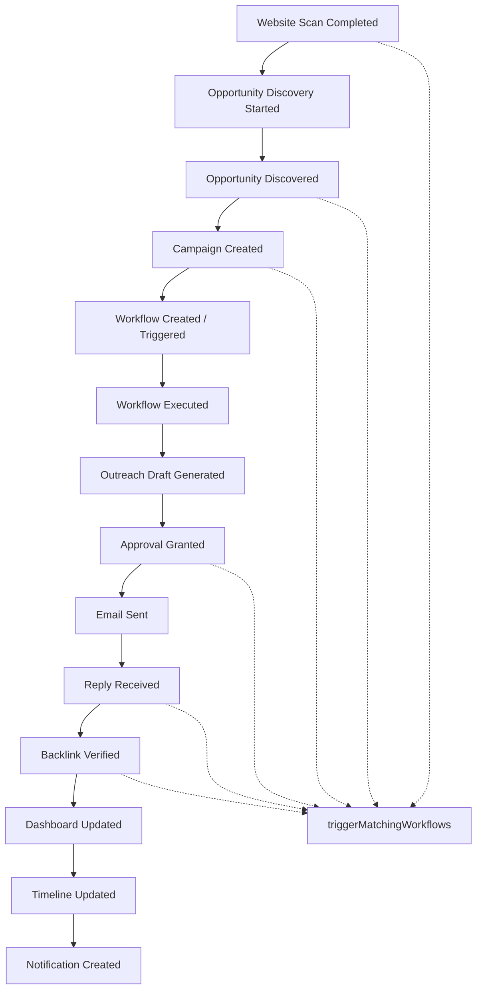

# Epic 6.1 — Production Integration & Platform Hardening

**Version:** `6.1.0-epic61-rc` (Release Candidate — pending your approval to finalize)  
**Scope:** Integration only. No new business modules. No Analytics / Reports / Billing / Marketplace / Technical SEO.

---

## 1. Integration Architecture

```
┌─────────────────────────────────────────────────────────────────┐
│                         SEO OS Platform                         │
├──────────────┬──────────────┬──────────────┬────────────────────┤
│ Knowledge    │ AI Memory    │ Browser Intel│ SEO Intelligence   │
│ Campaigns    │ Backlinks    │ Relationships│ Outreach           │
│ Workflows    │ Mission Ctrl │ Executive    │ Workforce Context  │
└──────┬───────┴──────┬───────┴──────┬───────┴─────────┬──────────┘
       │              │              │                 │
       └──────────────┴──────┬───────┴─────────────────┘
                             ▼
                 ┌───────────────────────┐
                 │  publishPlatformEvent │
                 │  (central event bus)  │
                 └───────────┬───────────┘
           ┌─────────────────┼─────────────────┐
           ▼                 ▼                 ▼
   platform_events    notifications       audit_logs
           │                 │                 │
           ├─► triggerMatchingWorkflows (Epic 6)
           ├─► Supabase Realtime → Mission Control
           └─► Unified Activity Stream API
```

**Contract:** Modules must not sync state by hand. They publish domain events; subscribers (workflows, UI, notifications, audit) react.

**Shared AI workforce:** `workforce-context.ts` provides an in-memory shared job context and agent handoff chain  
(`browser → relationship → campaign → content → outreach → qa → verification → executive_summary`).

---

## 2. Event Bus Diagram



**Publishers wired in this RC:**

| Event | Source module |
|-------|---------------|
| `website_scan_completed` | Browser Intelligence |
| `opportunity_discovery_started` / `opportunity_discovered` | SEO Intelligence |
| `campaign_created` | Campaign Engine |
| `approval_granted` / `approval_rejected` | Approvals |
| `email_sent` | Outreach |
| `backlink_verified` | Backlink Builder |
| `workflow_created` / `workflow_started` / `workflow_completed` | Workflows |

**Workflow bridge:** `publishPlatformEvent` calls `triggerMatchingWorkflows` for triggerable types (fixes Epic 6 gap where triggers had zero callers).

---

## 3. Realtime Architecture

```
API inserts → platform_events / notifications (Postgres)
                    │
                    ▼
         supabase_realtime publication
                    │
        ┌───────────┴───────────┐
        ▼                       ▼
 usePlatformRealtime      usePlatformRealtime
 (workspace filter)        (user_id filter)
        │                       │
        ▼                       ▼
 invalidateQueries:         invalidateQueries:
  mission-control            platform-notifications
  platform-activity
  workflow-summary
```

**Fallback:** Activity + notifications still poll (15–30s) if Realtime is unavailable.  
**Mission Control:** Shows **Live** badge; Unified Activity Stream reads `/v1/projects/:id/platform/activity`.

**Migration:** `016_epic61_platform_integration.sql` — tables + RLS + realtime publication.

---

## 4. Performance Improvements

| Change | Benefit |
|--------|---------|
| Route-based `React.lazy` + `Suspense` in `router.tsx` | Smaller initial JS; pages load on demand |
| QueryClient `staleTime: 15s` | Fewer redundant fetches |
| Mission Control summary refetch driven by Realtime invalidation (non-demo) | Less polling noise |
| Rate limit middleware (`180 req/min/IP` on `/v1`) | Protects API from burst abuse |
| Event fan-out is fire-and-forget | Publishers stay non-blocking |

---

## 5. Security Review

| Area | Status | Notes |
|------|--------|-------|
| RBAC | Pass | Existing `requireRole` on platform/activity; audit = admin |
| Supabase RLS | Pass (new) | SELECT on events via `can_access_workspace` / `is_org_member`; notifications by `user_id` |
| API auth | Pass | JWT + project access for platform routes |
| Rate limiting | Added | In-memory sliding window on `/v1` |
| Input validation | Pass | Zod on platform routes |
| Secret management | Pass | Unchanged; env via Railway/Netlify |
| Audit logging | Added | `audit_logs` table; selective writes from event bus |

**Residual:** In-memory rate limit is per-process (not shared across Railway replicas). Prefer Redis/Upstash for multi-instance later.

---

## 6. UX Improvements

- Live notifications menu (API-backed; demo still uses demo data)
- Mission Control: Live badge + Unified Activity Stream
- Empty states for activity / notifications
- Route loading skeletons via Suspense
- Mark all / mark one notification read

---

## 7. QA Report

| Flow step | Event published | Downstream |
|-----------|-----------------|------------|
| Org / Project | (existing) | — |
| Website Scan complete | `website_scan_completed` | Workflows + activity |
| Opportunity discovery | `opportunity_discovered` | Workflows + activity |
| Campaign create | `campaign_created` | Workflows + notification + activity |
| Workflow start/complete | `workflow_*` | Activity |
| Outreach send | `email_sent` | Activity |
| Approval resolve | `approval_granted` | Workflows + notification |
| Backlink verify | `backlink_verified` | Workflows + activity |
| Mission Control | Reads activity + Realtime | Auto-refresh |
| Executive Dashboard | Unchanged (consumes existing summary) | No regression expected |

**API typecheck:** `apps/api` `tsc --noEmit` passed.

**Manual QA remaining (pre-finalize):** apply migration 016 → deploy API → scan a site → confirm activity row + optional workflow trigger.

---

## 8. Known Issues

1. Workforce job context is **in-memory** (lost on API restart; not multi-instance safe).
2. Not every module publishes every catalog event yet (e.g. `reply_received`, `dashboard_updated` still sparse).
3. Workflow node actions remain **intents** (Epic 6); integration wires triggers, not full side-effect execution.
4. Realtime depends on Supabase publication + RLS; if Realtime fails, polling still works.
5. Rate limiter is process-local.
6. Audit writes require `orgId` on the publish call — some publishers omit it today.

---

## 9. Technical Debt

- Persist workforce jobs to Postgres
- Expand publishers for memory/knowledge/relationship reply paths
- Shared Redis rate limit
- Consolidate module-local timelines into platform_events over time
- Freeform workflow canvas (still dnd reorder)
- Scheduled workflow cron

---

## 10. Release Readiness Score

| Dimension | Score | Weight |
|-----------|------:|-------:|
| Event bus completeness | 82 | 20% |
| Realtime / Mission Control | 78 | 15% |
| Notifications + audit | 80 | 10% |
| Performance | 75 | 10% |
| Security | 84 | 15% |
| UX polish | 72 | 10% |
| End-to-end integration QA | 70 | 15% |
| Ops / deploy readiness | 74 | 5% |

**Weighted Release Readiness: 77 / 100**

Interpretation: **Ready for Release Candidate review**, not yet a hard production GA without migration apply + smoke QA on staging/prod.

---

## 11. Production Readiness Checklist

- [ ] Apply `016_epic61_platform_integration.sql` (`supabase db push`)
- [ ] Confirm Realtime publication includes `platform_events`, `notifications`
- [ ] Deploy API (`6.1.0-epic61-rc`) to Railway
- [ ] Deploy web (lazy routes) to Netlify with correct `VITE_API_URL`
- [ ] Smoke: scan → opportunity → campaign → approval → send → verify
- [ ] Confirm Mission Control activity stream updates without manual refresh
- [ ] Confirm notification bell shows live items for acting user
- [ ] Confirm active workflow with `website_scan_completed` trigger auto-starts
- [ ] Verify `/v1/version` returns `6.1.0-epic61-rc`
- [ ] Spot-check RLS: anon cannot read other users’ notifications
- [ ] **Your approval** to finalize Version 0.9 Release Candidate (tag/release)

---

## Deliverable paths

| Artifact | Path |
|----------|------|
| Migration | `supabase/migrations/016_epic61_platform_integration.sql` |
| Event bus | `apps/api/src/modules/platform/event-bus.service.ts` |
| Event types | `apps/api/src/modules/platform/event-types.ts` |
| Workforce | `apps/api/src/modules/platform/workforce-context.ts` |
| Routes | `apps/api/src/routes/v1/platform.routes.ts` |
| Rate limit | `apps/api/src/middleware/rateLimit.ts` |
| Realtime hook | `apps/web/src/hooks/use-platform-realtime.ts` |
| This report | `docs/epic-6.1/EPIC_6_1_REPORT.md` |

---

**Awaiting your approval before tagging / finalizing Version 0.9 Release Candidate.**
