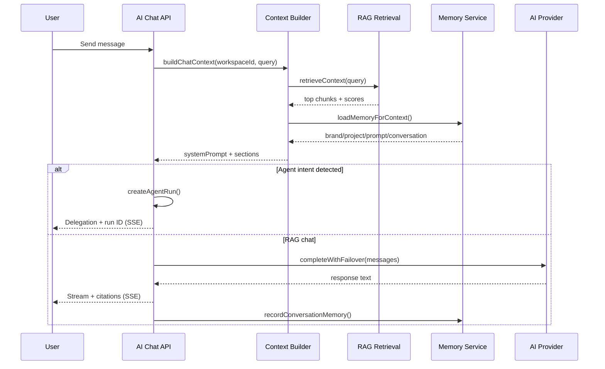

# Sprint 3 Report — Knowledge Engine

**Sprint goal:** Build the intelligence layer that powers every future AI feature.  
**API version:** `0.3.0-sprint3`  
**Date:** 2026-07-09  
**Status:** Complete — awaiting approval before Sprint 4

---

## Executive Summary

Sprint 3 delivers the Knowledge Engine: document upload and ingestion, chunking + embedding pipeline, hybrid RAG search, context builder, AI memory (brand/project/prompt/conversation), workspace chat with streaming and agent delegation, and Mission Control connected to real knowledge + workforce operations.

| Area                                                | Status            |
| --------------------------------------------------- | ----------------- |
| Knowledge Base (upload, chunk, embed, search)       | ✅                |
| RAG Foundation (retrieval, citations, validation)   | ✅                |
| AI Chat (streaming, history, prompts, agent invoke) | ✅                |
| AI Memory (4 tiers v1)                              | ✅                |
| Context Builder (auto-inject workspace context)     | ✅                |
| Mission Control (live KB + workforce stats)         | ✅                |
| Build / Lint / Typecheck                            | ✅ 10/10 packages |

**Sprint score: 90/100**  
**Recommendation: Conditional Go for Sprint 4**

---

## Knowledge Engine Architecture

```
┌─────────────────────────────────────────────────────────────────────────┐
│                              apps/web                                    │
│  Knowledge Library │ AI Command Center │ Memory Timeline │ Mission Control │
└───────────────────────────────┬─────────────────────────────────────────┘
                                │ REST + SSE
┌───────────────────────────────▼─────────────────────────────────────────┐
│                              apps/api                                    │
│  knowledge/*  │  chat/*  │  memory/*  │  context/workspace-context       │
│  jobs/handlers/ingest.ts  (pg-boss INGEST queue)                        │
└───────┬─────────────────────────────┬───────────────────────────────────┘
        │                             │
┌───────▼──────────────┐    ┌─────────▼──────────┐
│ @seo-os/knowledge-   │    │ @seo-os/ai-runtime │
│ engine               │    │ (agent delegation) │
│ chunking │ embedding │    └────────────────────┘
│ retrieval │ context  │
│ intent │ citations  │
└───────┬──────────────┘
        │
┌───────▼──────────────────────────────────────────────────┐
│ Supabase (migration 006)                                    │
│ kb_documents → kb_chunks → kb_embeddings (pgvector HNSW) │
│ memory_entries │ memory_facts │ ai_conversations/messages  │
│ keywords │ competitors │ kb_hybrid_search() RPC             │
└────────────────────────────────────────────────────────────┘
```

**Ingestion pipeline:**

1. User uploads document (text/markdown JSON API)
2. `kb_documents` row created (`pending`)
3. Sync ingest or `INGEST` queue job
4. Chunk (800 tokens ≈ 3200 chars, 100 token overlap)
5. Embed via Gemini `text-embedding-004` (768-dim, batched 20)
6. Store `kb_chunks` + `kb_embeddings`
7. Document status → `ready`

---

## RAG Architecture

| Stage      | Implementation                              | Freeze alignment             |
| ---------- | ------------------------------------------- | ---------------------------- |
| Chunking   | `packages/knowledge-engine/src/chunking.ts` | 800 tokens / 100 overlap     |
| Embedding  | `embedding.ts` — Gemini REST                | text-embedding-004, 768-dim  |
| Index      | HNSW cosine on `kb_embeddings`              | D7                           |
| Search     | `kb_hybrid_search` RPC                      | 0.7 vector + 0.3 tsvector    |
| Retrieval  | `retrieval.ts` — min score 0.7, top 5       | D9                           |
| Citations  | `citations.ts` — chunk → citation JSON      | ai_messages.citations        |
| Validation | `validateRetrieval()`                       | flags low-confidence answers |

**Fallback:** Without `GEMINI_API_KEY`, ingestion stores chunks only; search uses PostgreSQL full-text on `search_vector`.

---

## Memory Architecture

| Tier                   | Table                                                               | Sprint 3 support            |
| ---------------------- | ------------------------------------------------------------------- | --------------------------- |
| Brand memory           | `memory_entries` (tier=`brand`)                                     | ✅ Manual + auto from chat  |
| Project memory         | `memory_entries` (tier=`project`)                                   | ✅ Manual                   |
| Approved prompt memory | `memory_entries` (tier=`prompt`) + `memory_facts` (approved_prompt) | ✅                          |
| Conversation memory    | `memory_entries` (tier=`conversation`)                              | ✅ Auto on chat             |
| Semantic facts         | `memory_facts`                                                      | ✅ Create + manager approve |

**Context injection:** `loadMemoryForContext()` groups entries by tier; approved facts merged into brand/project/prompt buckets.

**Constraint:** No cross-project memory (workspace-scoped only).

---

## AI Chat Architecture

```
User message (POST .../chat/conversations/:id/messages)
    │
    ├─► Store ai_messages (role=user)
    ├─► classifyIntent() — @mentions + keyword patterns
    │
    ├─► [Agent path] confidence ≥ 0.75
    │       └─► createAgentRun() → delegate response + agent_run_id
    │
    └─► [RAG chat path]
            ├─► buildChatContext() — full workspace context
            ├─► retrieveContext() — hybrid KB search
            ├─► AI provider completeWithFailover()
            ├─► citations attached to assistant message
            ├─► recordConversationMemory()
            └─► SSE stream chunks to client
```

**Features delivered:**

- Workspace-scoped conversations (`ai_conversations`)
- Message history (`ai_messages` with citations JSONB)
- Suggested prompts (`GET /chat/prompts`)
- Streaming via Server-Sent Events
- Agent invocation via `@ceo`, `@qa`, or intent keywords

---

## Context Flow



**Context Builder injects:**

| Source       | Data                                                     |
| ------------ | -------------------------------------------------------- |
| Project      | name, domain, industry, description                      |
| Organization | name, industry                                           |
| Brand voice  | `workspace_settings.brand_voice`                         |
| SEO goals    | `workspace_settings.seo_goals`                           |
| Keywords     | `keywords` table                                         |
| Competitors  | `competitors` table                                      |
| AI settings  | `ai_settings` (provider, temperature, max tokens)        |
| Memory       | brand, project, approved prompts, conversation, episodic |
| Documents    | ready KB document list                                   |
| Retrieval    | top RAG chunks for current query                         |

---

## API Endpoints (New)

### Knowledge Base — `/v1/projects/:id/knowledge`

| Method | Path                       | Description      |
| ------ | -------------------------- | ---------------- |
| GET    | `/documents`               | List documents   |
| POST   | `/documents`               | Upload document  |
| GET    | `/documents/:docId`        | Get document     |
| DELETE | `/documents/:docId`        | Archive document |
| POST   | `/documents/:docId/ingest` | Re-run ingestion |
| GET    | `/search?q=`               | Hybrid KB search |
| GET    | `/stats`                   | KB statistics    |

### Memory — `/v1/projects/:id/knowledge/memory`

| Method | Path                 | Description             |
| ------ | -------------------- | ----------------------- |
| GET    | `/`                  | List entries + facts    |
| POST   | `/entries`           | Create memory entry     |
| POST   | `/facts`             | Create semantic fact    |
| POST   | `/facts/:id/approve` | Approve fact (manager+) |

### AI Chat — `/v1/projects/:id/chat`

| Method | Path                          | Description                       |
| ------ | ----------------------------- | --------------------------------- |
| GET    | `/prompts`                    | Suggested prompts                 |
| GET    | `/conversations`              | List conversations                |
| POST   | `/conversations`              | Create conversation               |
| GET    | `/conversations/:id/messages` | Message history                   |
| POST   | `/conversations/:id/messages` | Send message (JSON or SSE stream) |

### Mission Control

| Method | Path                       | Description                          |
| ------ | -------------------------- | ------------------------------------ |
| GET    | `/mission-control/summary` | KB + memory + chat + workforce stats |

---

## Database — Migration 006

**File:** `supabase/migrations/006_knowledge_engine.sql`

| Table               | Purpose                                           |
| ------------------- | ------------------------------------------------- |
| `kb_documents`      | Uploaded document metadata + content              |
| `kb_chunks`         | Chunked text + generated tsvector                 |
| `kb_embeddings`     | 768-dim vectors (HNSW index)                      |
| `kb_ingestion_jobs` | Ingestion job tracking                            |
| `memory_entries`    | Episodic/brand/project/conversation/prompt memory |
| `memory_facts`      | Semantic facts with approval workflow             |
| `keywords`          | Target keywords per project                       |
| `competitors`       | Competitor domains per project                    |
| `ai_conversations`  | Chat sessions                                     |
| `ai_messages`       | Messages with citations + agent_run_id            |

**RPC:** `kb_hybrid_search(workspace_id, query, query_embedding, limit, min_score)`

**Apply:** `npm run db:push`

---

## Web UI

| Page              | Route                             | Features                                       |
| ----------------- | --------------------------------- | ---------------------------------------------- |
| Knowledge Library | `/projects/:id/knowledge/library` | Upload, list, re-ingest, archive               |
| AI Command Center | `/projects/:id/command-center`    | Chat, suggested prompts, SSE streaming         |
| Memory Timeline   | `/projects/:id/memory/timeline`   | Add brand/project/prompt memory, approve facts |
| Mission Control   | `/projects/:id/mission-control`   | Live KB/memory/chat/workforce summary cards    |

**Feature flags:** `knowledge_base` and `ai_memory` enabled by default in Sprint 3.

---

## Updated Project Tree

```
packages/
├── knowledge-engine/          # NEW — Sprint 3
│   └── src/
│       ├── chunking.ts
│       ├── embedding.ts
│       ├── retrieval.ts
│       ├── citations.ts
│       ├── context-builder.ts
│       └── intent.ts
├── shared/src/feature-flags/  # knowledge_base + ai_memory enabled
└── shared/src/schemas/        # upload, memory, chat schemas

apps/api/src/
├── modules/
│   ├── knowledge/             # document, ingestion, search
│   ├── memory/                # memory.service
│   ├── chat/                  # chat.service (SSE + agents)
│   └── context/               # workspace-context.service
├── routes/v1/
│   ├── knowledge.routes.ts
│   └── chat.routes.ts
└── jobs/handlers/ingest.ts

apps/web/src/pages/
├── knowledge/library.tsx      # NEW
├── command-center.tsx         # NEW
├── memory/timeline.tsx        # NEW
└── mission-control.tsx        # Updated — live summary

supabase/migrations/
└── 006_knowledge_engine.sql   # NEW

docs/sprint-3/
└── SPRINT_3_REPORT.md
```

---

## Verification

```bash
npm run build      # ✅ 10/10 packages
npm run lint       # ✅
npm run typecheck  # ✅ 15/15 tasks
```

**Manual checklist:**

- [ ] Apply migrations 005 + 006
- [ ] Set `GEMINI_API_KEY` for embeddings + chat
- [ ] Upload a document → verify `ready` status + chunks
- [ ] Search: `GET .../knowledge/search?q=...`
- [ ] Open Command Center → send message → see streamed response
- [ ] Try `@ceo analyze our strategy` → agent delegation
- [ ] Add brand memory → verify in chat context
- [ ] Mission Control shows non-zero KB/memory stats

---

## Sprint Score: 90/100

| Category        | Score      | Notes                                                             |
| --------------- | ---------- | ----------------------------------------------------------------- |
| Knowledge Base  | 18/20      | Text upload; PDF/DOCX parser deferred                             |
| RAG             | 17/20      | Hybrid search RPC; embedding insert may need raw SQL tuning       |
| AI Memory       | 17/20      | 4 tiers v1; no nightly consolidation job                          |
| AI Chat         | 19/20      | SSE streaming; provider stream not native-token-level             |
| Context Builder | 19/20      | Full injection; keywords/competitors tables empty until populated |
| **Total**       | **90/100** |                                                                   |

---

## Risks

| Risk                                            | Severity | Mitigation                                           |
| ----------------------------------------------- | -------- | ---------------------------------------------------- |
| pgvector extension unavailable on Supabase plan | High     | Verify extension before `db:push`                    |
| Embedding dimension mismatch                    | Medium   | Truncation to 768 in embedding provider              |
| Vector insert via Supabase JS                   | Medium   | Falls back to text-only search if embed insert fails |
| No PDF/DOCX parsing                             | Low      | Text paste upload works; parsers in Sprint 4+        |
| Chat without API key                            | Medium   | KB excerpt fallback message shown                    |
| Migration 006 depends on 005                    | High     | Apply in order                                       |

---

## Technical Debt

1. **File formats** — PDF/DOCX/URL ingest not implemented (freeze lists them for later)
2. **Native token streaming** — SSE delivers chunked complete response, not provider-native stream
3. **Keywords/competitors UI** — Tables exist; no CRUD UI yet (context reads empty lists)
4. **Memory consolidation** — No `memory.consolidate` nightly job
5. **Ingest worker isolation** — Runs in API process unless `ENABLE_WORKERS=true`
6. **SSRF / robots.txt** — URL ingest excluded per sprint scope
7. **Retrieval validation** — Warns on low confidence; does not block response

---

## Go / No-Go for Sprint 4

### Recommendation: **Conditional Go**

**Proceed when:**

1. Migrations 005 + 006 applied to dev/staging
2. End-to-end flow verified: upload → ingest → chat with citations
3. `GEMINI_API_KEY` configured for embeddings

**Suggested Sprint 4 focus (pending approval):**

- Populate keywords/competitors UI
- PDF/DOCX upload parsing
- Native provider streaming
- Agent business logic for SEO Strategist + Research Manager
- Mission Control activity widgets from real chat + KB events

---

## Explicitly Excluded (Confirmed)

Backlink Builder, Outreach, Reports, Analytics, Technical SEO, Competitor Intelligence business logic — **not implemented**.

---

**Awaiting your approval before beginning Sprint 4.**
