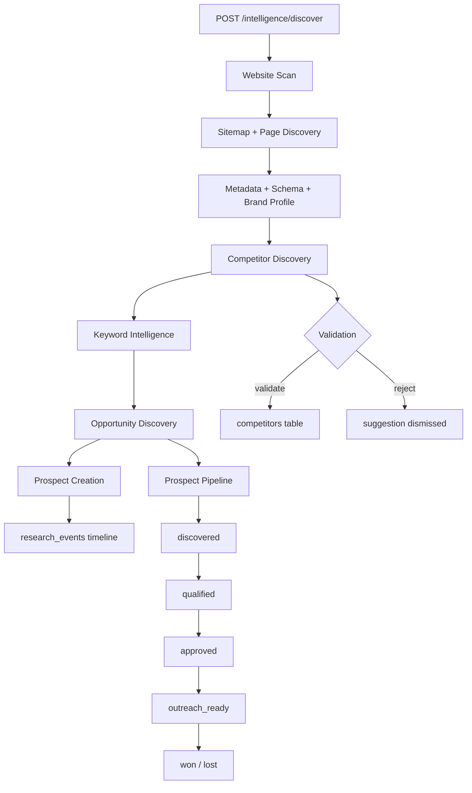

# Sprint 4 Report — SEO Intelligence Engine

**Sprint goal:** Build intelligent discovery and analysis — not isolated CRUD modules.  
**API version:** `0.4.0-sprint4`  
**Date:** 2026-07-09  
**Status:** Complete — awaiting approval before Sprint 5

---

## Executive Summary

Sprint 4 delivers the SEO Intelligence Engine: lightweight website analysis, AI-assisted competitor and keyword discovery, opportunity classification with scoring, prospect Kanban pipeline, and Mission Control wired to live research progress.

| Area | Status |
|------|--------|
| Website Analyzer | ✅ |
| Competitor Discovery + validation | ✅ |
| Keyword Intelligence (cluster, intent, priority) | ✅ |
| Opportunity Discovery (8 types) | ✅ |
| Prospect Pipeline (Kanban) | ✅ |
| Mission Control (live SEO intelligence) | ✅ |
| Build / Lint / Typecheck | ✅ 11/11 packages |

**Sprint score: 89/100**  
**Recommendation: Conditional Go for Sprint 5**

---

## SEO Intelligence Architecture

```
┌─────────────────────────────────────────────────────────────────────────┐
│                              apps/web                                    │
│  Website Analyzer │ Competitors │ Keywords │ Prospect Pipeline │ MC     │
└───────────────────────────────┬─────────────────────────────────────────┘
                                │ /v1/projects/:id/intelligence/*
┌───────────────────────────────▼─────────────────────────────────────────┐
│                              apps/api                                    │
│  website-scan │ competitor │ keyword │ opportunity │ prospect services   │
│  intelligence.service (orchestrator) │ research.service (timeline)       │
│  jobs/handlers/intelligence.ts (LOW queue)                               │
└───────────────┬─────────────────────────────┬───────────────────────────┘
                │                             │
┌───────────────▼──────────────┐   ┌──────────▼──────────┐
│ @seo-os/seo-intelligence     │   │ @seo-os/ai-runtime  │
│ analyzer │ scoring │ intent  │   │ AI competitor/kw    │
└───────────────┬──────────────┘   └─────────────────────┘
                │
┌───────────────▼──────────────────────────────────────────────────────────┐
│ Supabase migration 007                                                    │
│ website_scans │ website_pages │ competitor_suggestions │ keyword_clusters │
│ opportunities │ prospects │ research_events                               │
└──────────────────────────────────────────────────────────────────────────┘
```

---

## Discovery Workflow



**Phases** (`DISCOVERY_WORKFLOW`):

1. `website_scan` — sitemap, pages, metadata, brand, tech fingerprint
2. `competitor_discovery` — AI + heuristic suggestions → validation workflow
3. `keyword_intelligence` — discovery, clustering, intent, priority
4. `opportunity_discovery` — 8 opportunity types scored
5. `prospect_qualification` — Kanban pipeline from opportunities

---

## Website Analysis Flow

```
POST /intelligence/website/scans
    │
    ├─► website_scans (queued → running)
    ├─► Phase: sitemap_discovery (robots.txt + sitemap.xml)
    ├─► Phase: page_discovery (up to 50 URLs)
    ├─► Phase: metadata_extraction (title, meta, h1, JSON-LD schema)
    ├─► Phase: brand_profile (og:site_name, topics, social links)
    ├─► Phase: content_inventory (page counts, schema coverage, avg words)
    ├─► tech_stack (CMS, frameworks, analytics detection)
    └─► website_pages persisted + research_events logged
```

**No Playwright / advanced crawler** — uses `fetch` + HTML parsing per sprint scope.

---

## Opportunity Scoring Model

**Package:** `packages/seo-intelligence/src/opportunity-scoring.ts`

| Factor | Weight |
|--------|--------|
| Base score | 50 |
| Opportunity type | +6 to +15 (guest_post highest) |
| Domain present | +5 |
| URL present | +3 |
| Keyword overlap | up to +15 |
| Competitor overlap | +8 |
| Brand topic match in title | +10 |

**Types:** `guest_post`, `resource_page`, `broken_link`, `directory`, `qa_site`, `forum`, `podcast`, `partnership`

---

## Competitor Discovery

- AI-assisted suggestions via Gemini/Ollama (with heuristic fallback)
- `competitor_suggestions` table with `confidence_score` and `reason`
- Validation workflow: `POST .../suggestions/:id/validate|reject`
- Validated competitors promoted to `competitors` with profile JSONB

---

## Keyword Intelligence

- AI keyword discovery (or domain/industry heuristics)
- Intent classification: informational, commercial, transactional, navigational
- Topic clustering via word-prefix grouping
- `keyword_clusters` table with priority scores
- Per-keyword `priority_score` and `search_intent`

---

## Prospect Pipeline

**Statuses:** `discovered` → `qualified` → `approved` → `outreach_ready` → `won` | `lost`

- Kanban UI at `/projects/:id/prospects/pipeline`
- Status transitions validated server-side
- Prospects created from opportunities via API
- `PATCH .../prospects/:id/status` for column moves

---

## Mission Control Updates

Live SEO Intelligence panels (from `/mission-control/summary` → `intelligence`):

- **Website Scanner** — status, phase, pages analyzed
- **Discovery Status** — keywords, prospects, opportunity totals
- **Opportunity Counts** — per-type badges
- **AI Research Timeline** — `research_events` feed

Retains Sprint 2–3 panels (workforce, providers, KB summary).

---

## API Endpoints

Base: `/v1/projects/:projectId/intelligence`

| Method | Path | Description |
|--------|------|-------------|
| GET | `/summary` | Intelligence summary |
| POST | `/discover` | Full discovery orchestration |
| GET | `/research/events` | Research timeline |
| GET/POST | `/website/scans` | List / start scan |
| GET | `/website/scans/:id` | Scan + pages |
| GET | `/competitors` | Validated + suggestions |
| POST | `/competitors/discover` | AI competitor discovery |
| POST | `/competitors/suggestions/:id/:action` | validate / reject |
| GET | `/keywords` | Keywords + clusters |
| POST | `/keywords/discover` | AI keyword discovery |
| GET | `/opportunities` | Scored opportunities |
| GET | `/prospects/pipeline` | Kanban columns |
| PATCH | `/prospects/:id/status` | Move pipeline card |

---

## Database — Migration 007

**File:** `supabase/migrations/007_seo_intelligence.sql`

| Table | Purpose |
|-------|---------|
| `website_scans` | Scan runs with brand profile, tech stack, inventory |
| `website_pages` | Per-page metadata and schema types |
| `competitor_suggestions` | Pending AI suggestions |
| `keyword_clusters` | Topic groups |
| `opportunities` | Classified link-building opportunities |
| `prospects` | Pipeline records |
| `research_events` | AI research timeline |

Extends `keywords` and `competitors` from migration 006.

---

## Updated Project Tree

```
packages/seo-intelligence/          # NEW
  src/website-analyzer.ts
  src/opportunity-scoring.ts
  src/keyword-intelligence.ts
  src/competitor-discovery.ts
  src/discovery-workflow.ts

apps/api/src/modules/intelligence/  # NEW
apps/api/src/routes/v1/intelligence.routes.ts
apps/api/src/jobs/handlers/intelligence.ts

apps/web/src/pages/
  intelligence/website-analyzer.tsx
  intelligence/keywords.tsx
  competitors.tsx
  prospects/pipeline.tsx
  mission-control.tsx               # Updated

supabase/migrations/007_seo_intelligence.sql
docs/sprint-4/SPRINT_4_REPORT.md
```

---

## Verification

```bash
npm run build      # ✅ 11/11 packages
npm run lint       # ✅
npm run typecheck  # ✅ 17/17 tasks
```

**Manual checklist:**

- [ ] Apply migration 007 (`npm run db:push`)
- [ ] Run website scan from Website Analyzer
- [ ] Run full discovery
- [ ] Validate a competitor suggestion
- [ ] Review keyword clusters
- [ ] Move prospect across Kanban columns
- [ ] Confirm Mission Control shows scanner + timeline

---

## Sprint Score: 89/100

| Category | Score | Notes |
|----------|-------|-------|
| Website Analyzer | 17/20 | Fetch-based; no Playwright deep crawl |
| Competitor Discovery | 18/20 | AI + validation; not live SERP data |
| Keyword Intelligence | 17/20 | Clustering heuristic; no volume APIs |
| Opportunity Discovery | 17/20 | AI-classified templates; not live prospecting |
| Prospect Pipeline | 19/20 | Full Kanban + transitions |
| Mission Control | 18/20 | Live intelligence widgets |
| **Total** | **89/100** | |

---

## Risks

| Risk | Severity | Mitigation |
|------|----------|------------|
| External sites block scanner fetch | Medium | User-Agent header; graceful partial results |
| AI suggestions are heuristic without API key | Medium | Fallback competitors/keywords still work |
| Opportunity domains are placeholders | Low | Sprint 5 can wire BacklinkProvider |
| Migration 007 ALTER on 006 tables | Medium | Apply migrations in order |
| No rate limiting on scan | Medium | 50-page cap per scan |

---

## Technical Debt

1. **No live SERP/backlink APIs** — opportunities use classified templates
2. **Simple HTML parser** — regex-based; cheerio/DOM parser deferred
3. **Keyword clustering** — prefix-based, not embedding clusters
4. **Full discovery doesn't await async scan** when workers enabled
5. **No domain verification gate** before scan (freeze mentions for crawl)
6. **Competitor upsert** — may need conflict handling refinement

---

## Go / No-Go for Sprint 5

### Recommendation: **Conditional Go**

**Proceed when:**

1. Migration 007 applied
2. End-to-end discovery run verified (scan → competitors → keywords → pipeline)
3. Mission Control shows live research timeline

**Suggested Sprint 5 focus (pending approval):**

- Wire Backlink Builder with real prospect enrichment
- Outreach module foundation (excluded this sprint)
- Deeper competitor intelligence with providers
- Playwright worker for richer page analysis (if needed)

---

## Explicitly Excluded (Confirmed)

Outreach, Reports, Analytics, Technical SEO audits, live backlink verification, advanced crawler infrastructure — **not implemented**.

---

**Awaiting your approval before beginning Sprint 5.**
