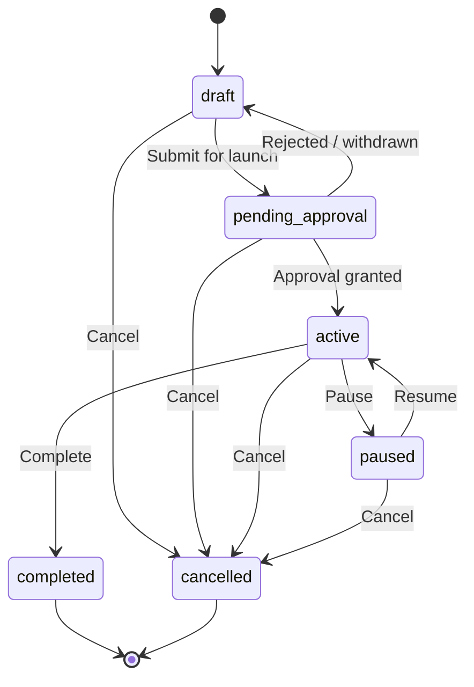

# Sprint 5 Report — AI Campaign Engine

**Sprint goal:** Turn discovered SEO opportunities into structured, approvable campaigns — not a standalone backlink builder.  
**API version:** `0.5.0-sprint5`  
**Date:** 2026-07-09  
**Status:** Complete — awaiting approval before Sprint 6

---

## Executive Summary

Sprint 5 delivers the AI Campaign Engine: extensible campaign types, lifecycle management, opportunity queue with bulk actions and AI recommendations, centralized approval workflows, AI campaign planning from project context, and Mission Control extended with campaign progress and pending approvals.

| Area                                                                        | Status            |
| --------------------------------------------------------------------------- | ----------------- |
| Campaign Management (create, templates, goals, lifecycle, status, timeline) | ✅                |
| Campaign Types (11 types, DB registry, extensible)                          | ✅                |
| Opportunity Queue (review, approve/reject, bulk, priority, AI recs)         | ✅                |
| AI Campaign Planner (KB + intelligence context)                             | ✅                |
| Approval Center (opportunities, email/content drafts, campaign launch)      | ✅                |
| Mission Control (active campaigns, approvals, progress, timeline)           | ✅                |
| Build / Lint / Typecheck                                                    | ✅ 12/12 packages |

**Sprint score: 88/100**  
**Recommendation: Conditional Go for Sprint 6**

---

## Campaign Architecture

```
┌─────────────────────────────────────────────────────────────────────────┐
│                              apps/web                                    │
│  Campaigns │ Opportunity Queue │ Approval Center │ Campaign Detail │ MC   │
└───────────────────────────────┬─────────────────────────────────────────┘
                                │ /v1/projects/:id/campaigns/*
┌───────────────────────────────▼─────────────────────────────────────────┐
│                              apps/api                                    │
│  campaign.service        — CRUD, lifecycle, timeline, progress           │
│  opportunity-queue.service — queue, bulk review, AI recommendations      │
│  approval.service        — centralized approvals + draft stubs           │
│  planner.service         — AI plan from KB + intelligence summary        │
└───────────────┬─────────────────────────────┬───────────────────────────┘
                │                             │
┌───────────────▼──────────────┐   ┌──────────▼──────────┐
│ @seo-os/campaign-engine      │   │ @seo-os/ai-runtime  │
│ types │ lifecycle │ planner  │   │ Gemini/Ollama plan  │
│ approval-workflow            │   │ generation          │
└───────────────┬──────────────┘   └─────────────────────┘
                │
┌───────────────▼──────────────────────────────────────────────────────────┐
│ Supabase migration 008                                                    │
│ campaign_types │ campaign_templates │ campaigns │ campaign_opportunities │
│ campaign_timeline_events │ approvals │ email_drafts │ content_drafts    │
│ opportunities (priority, queue_status, ai_recommendation, campaign_id)   │
└──────────────────────────────────────────────────────────────────────────┘
```

### Extensibility Model

Campaign types are **not hardcoded-only**. The `campaign_types` registry table is the source of truth; TypeScript constants in `@seo-os/campaign-engine` mirror the seeded set for validation. New types can be added via DB insert + optional template seed without changing core tables or API route structure.

**Seeded types:** `guest_post`, `resource_page`, `broken_link`, `directory`, `citation`, `qa_site`, `forum`, `podcast`, `partnership`, `press_release`, `digital_pr`

---

## Campaign Lifecycle



| Status             | Meaning                                                  |
| ------------------ | -------------------------------------------------------- |
| `draft`            | Campaign created; plan and opportunities can be attached |
| `pending_approval` | Launch approval requested; appears in Approval Center    |
| `active`           | Approved and running                                     |
| `paused`           | Temporarily halted                                       |
| `completed`        | Finished successfully                                    |
| `cancelled`        | Abandoned                                                |

**Progress calculation** (`computeCampaignProgress`):

- `draft` / `pending_approval` / `cancelled` → 0%
- `completed` → 100%
- `active` / `paused` → ratio of approved opportunities in campaign (min 10% when active with no opps)

**Timeline events** are logged to `campaign_timeline_events` on create, status change, opportunity attach, and post-approval launch.

---

## Approval Workflow

Centralized in `approvals` table with types:

| Type              | Trigger                           | Resolution                                          |
| ----------------- | --------------------------------- | --------------------------------------------------- |
| `campaign_launch` | PATCH status → `pending_approval` | Approve → campaign `active`; Reject → stays pending |
| `email_draft`     | POST submit draft                 | Approve/reject → updates `email_drafts.status`      |
| `content_draft`   | POST submit draft                 | Approve/reject → updates `content_drafts.status`    |

**Opportunity queue** uses direct approve/reject on `opportunities.queue_status` (not duplicated into approvals table) to avoid noise. The Approval Center focuses on launch, email, and content draft gates.

**Explicitly excluded (future sprints):** email delivery, CRM inbox, follow-up automation.

---

## Opportunity Queue Design

```
SEO Intelligence discovery
        │
        ▼
opportunities (queue_status: pending_review)
        │
        ├─► AI enrich (score-based recommendation text)
        ├─► Individual approve / reject
        ├─► Bulk approve / reject
        ├─► Priority adjustment (0–100)
        └─► Attach approved → campaign_opportunities
```

| Field               | Purpose                                                    |
| ------------------- | ---------------------------------------------------------- |
| `priority`          | Manual ordering (desc) alongside score                     |
| `queue_status`      | `pending_review` \| `approved` \| `rejected` \| `archived` |
| `ai_recommendation` | Human-readable AI suggestion                               |
| `campaign_id`       | Link when added to a campaign                              |

**AI recommendations** (`recommendOpportunities` + `enrichOpportunityRecommendations`):

- Score ≥ 75 → "Strong fit — approve for campaign"
- Score ≥ 60 → "Moderate fit — review before approving"
- Else → "Low priority — consider rejecting"

---

## AI Campaign Planner

`POST /v1/projects/:id/campaigns/plan`

**Inputs:** campaign type, project goals  
**Context assembled from:**

- Project name + domain
- Knowledge base stats (`getKnowledgeStats`)
- Intelligence summary (`getIntelligenceSummary`)
- Opportunity queue size

**Output:** `CampaignPlan` with phases, actions, target opportunities, `aiGenerated` flag.

Falls back to `buildDefaultPlan` when AI providers unavailable.

---

## Updated Mission Control

`GET /v1/projects/:id/mission-control/summary` now includes `campaigns`:

| Panel             | Data                                            |
| ----------------- | ----------------------------------------------- |
| Active Campaigns  | active count, total, avg progress               |
| Pending Approvals | approval queue count, campaigns awaiting launch |
| Recent Campaigns  | top 5 with progress links                       |
| Campaign Timeline | last 8 lifecycle events                         |

Web UI adds campaign cards and quick links to Campaigns and Approval Center.

---

## API Surface

| Method   | Path                                 | Description               |
| -------- | ------------------------------------ | ------------------------- |
| GET      | `/campaigns/types`                   | List campaign types       |
| GET      | `/campaigns/templates`               | List templates            |
| GET      | `/campaigns/summary`                 | Aggregate stats           |
| GET/POST | `/campaigns`                         | List / create             |
| POST     | `/campaigns/plan`                    | AI campaign plan          |
| GET      | `/campaigns/:id`                     | Campaign detail           |
| GET      | `/campaigns/:id/timeline`            | Timeline events           |
| PATCH    | `/campaigns/:id/status`              | Lifecycle transition      |
| POST     | `/campaigns/:id/opportunities`       | Attach opportunities      |
| GET      | `/campaigns/queue/opportunities`     | Opportunity queue         |
| GET      | `/campaigns/queue/recommendations`   | AI-ranked opportunities   |
| POST     | `/campaigns/queue/enrich`            | Batch AI recommendations  |
| POST     | `/campaigns/queue/bulk-review`       | Bulk approve/reject       |
| PATCH    | `/campaigns/queue/opportunities/:id` | Single review             |
| GET      | `/campaigns/approvals`               | Approval list             |
| PATCH    | `/campaigns/approvals/:id`           | Resolve approval          |
| GET/POST | `/campaigns/drafts/*`                | Email/content draft stubs |

---

## Explicitly Excluded (per roadmap)

| Feature                    | Sprint    |
| -------------------------- | --------- |
| Email delivery             | Sprint 7+ |
| CRM inbox                  | Sprint 7+ |
| Follow-up automation       | Sprint 7+ |
| Reports                    | Sprint 8  |
| Analytics                  | Sprint 7+ |
| Live backlink verification | Future    |

---

## Sprint Score: 88/100

| Category             | Score | Notes                                         |
| -------------------- | ----- | --------------------------------------------- |
| Scope completion     | 92    | All in-scope items delivered                  |
| Architecture quality | 90    | Extensible type registry, clean package split |
| UI completeness      | 82    | Functional pages; draft creation UI minimal   |
| Integration          | 88    | MC + intelligence + KB wired                  |
| Test coverage        | 70    | No dedicated campaign tests yet               |
| Production readiness | 85    | Migration 008 must be applied                 |

**Deductions:** No E2E tests for approval flows; opportunity→campaign attach not exposed in web UI yet; planner uses lightweight prompt vs full RAG context.

---

## Risks

| Risk                                                      | Severity | Mitigation                                                      |
| --------------------------------------------------------- | -------- | --------------------------------------------------------------- |
| Migration 008 not applied in staging                      | High     | Run `npm run db:push` before QA                                 |
| Opportunity status constraint change breaks existing data | Medium   | Migration widens status; existing rows default `pending_review` |
| Approval + status dual-write for launch                   | Medium   | Documented flow; reject leaves campaign in `pending_approval`   |
| AI planner quality without full RAG                       | Low      | Fallback plan always available                                  |
| No attach-opportunities UI                                | Medium   | API ready; Sprint 6 outreach can add UX                         |

---

## Go / No-Go for Sprint 6

**Recommendation: Conditional Go**

**Go if:**

1. Migration 008 applied and smoke-tested on a project with discovery data
2. At least one campaign created end-to-end (plan → create → submit → approve → active)
3. Opportunity queue tested with bulk actions after discovery run

**No-Go if:**

- Approval launch flow fails to activate campaigns
- Opportunity queue empty after discovery (data pipeline regression)

**Suggested Sprint 6 focus (pending your approval):** Outreach Engine — email draft UX, template library, send pipeline (not inbox), connecting approved opportunities to outreach sequences.

---

## Files Added / Modified

**New:**

- `supabase/migrations/008_campaign_engine.sql`
- `packages/campaign-engine/`
- `apps/api/src/modules/campaigns/*.ts`
- `apps/api/src/routes/v1/campaigns.routes.ts`
- `apps/web/src/pages/campaigns/*.tsx`
- `docs/sprint-5/SPRINT_5_REPORT.md`

**Modified:**

- `apps/api/src/modules/ai/infra.service.ts` — campaign summary in MC
- `apps/api/src/routes/v1/index.ts` — mount + version bump
- `apps/web/src/pages/mission-control.tsx`
- `apps/web/src/config/navigation.ts`
- `apps/web/src/app/router.tsx`

---

_Awaiting your approval before beginning Sprint 6._
